# Plataforma de Gestión Operativa y Analítica para la Recolección de Residuos Urbanos

---

| Campo                         | Detalle                                                                                                                                                               |
| ----------------------------- | --------------------------------------------------------------------------------------------------------------------------------------------------------------------- |
| Nombre del sistema            | Plataforma de Gestión Operativa y Analítica para la Recolección de Residuos Urbanos                                                                                   |
| Grupo                         | Grupo 2                                                                                                                                                               |
| Integrantes                   | Michael José Jiménez Montero — 503580589<br>Gregory José Morera Torres — 115190172<br>Milton Alvarado Ramírez — 503510070<br>Juan Ignacio González Cortes — 118760078 |
| URL del repositorio           | https://github.com/gmorerat-gif/pswe04-Gesti-n-Operativa-y-Anal-tica-para-la-Recolecci-n-de-Residuos-Urbanos-II-Cuatrimestre                                          |
| Docente                       | JUAN MAURICIO LEANDRO JIMENEZ                                                                                                                                         |
| Cuatrimestre                  | 2026 — 2                                                                                                                                                              |
| Versión del documento         | 0.4 — Entrega final                                                                                                                                                   |
| Fecha de última actualización | 2026-08-122                                                                                                                                                           |

---

## Historial de versiones

| Versión | Fecha      | Hito                | Cambios principales                                                                                                                                                                                                            | Autor(es)                                                                                |
| ------- | ---------- | ------------------- | ------------------------------------------------------------------------------------------------------------------------------------------------------------------------------------------------------------------------------ | ---------------------------------------------------------------------------------------- |
| 0.1     | 23/06/2026 | Propuesta (S03)     | Creación del documento inicial.                                                                                                                                                                                                | Michael José Jiménez, Gregory José Morera, Milton Alvarado, Juan Ignacio González Cortes |
| 0.2     | 28/06/2026 | Avance 1 (S07)      | Desarrollo del contexto del sistema, stakeholders, drivers arquitectónicos, escenarios de calidad y vista de contexto (C4 Nivel 1).                                                                                            | Michael José Jiménez, Gregory José Morera, Milton Alvarado, Juan Ignacio González Cortes |
| 0.3     | 12/07/2026 | Avance 2 (S11)      | Atención de las observaciones derivadas del Avance 1. Desarrollo de la Vista de Estructura Interna (C4 Nivel 2 – Contenedores), Estilo Arquitectónico, Análisis de Trade-offs y Registro de Decisiones Arquitectónicas (ADRs). | Michael José Jiménez, Gregory José Morera, Milton Alvarado, Juan Ignacio González Cortes |
| 0.4     | 18/08/2026 | Entrega final (S14) | Atención de las observaciones derivadas del Avance 2. Desarrollo Vistas de contenedores C4, Diseño detallado de componentes, Patrones aplicados, Análisis de calidad y Sección de tendencias.                                  | Michael José Jiménez, Gregory José Morera, Milton Alvarado, Juan Ignacio González Cortes |

---

## Tabla de contenidos

1. [Descripción del sistema y alcance](#1-descripción-del-sistema-y-alcance)
   - 1.1 [Descripción general](#11-descripción-general)
   - 1.2 [Contexto del negocio o dominio](#12-contexto-del-negocio-o-dominio)
   - 1.3 [Alcance del sistema](#13-alcance-del-sistema)
   - 1.4 [Usuarios y casos de uso principales](#14-usuarios-y-casos-de-uso-principales)
   - 1.5 [Problema arquitectónico central](#15-problema-arquitectónico-central)

2. [Stakeholders](#2-stakeholders)

3. [Drivers arquitectónicos](#3-drivers-arquitectónicos)
   - 3.1 [Requerimientos funcionales clave](#31-requerimientos-funcionales-clave)
   - 3.2 [Atributos de calidad prioritarios](#32-atributos-de-calidad-prioritarios)
   - 3.3 [Restricciones que actúan como drivers](#33-restricciones-que-actúan-como-drivers)

4. [Requerimientos de calidad — Escenarios](#4-requerimientos-de-calidad--escenarios)
   - 4.1 [Trazabilidad hacia decisiones arquitectónicas](#41-trazabilidad-hacia-decisiones-arquitectónicas-del-avance-2)
   - 4.2 [Trazabilidad hacia los ADRs seleccionados](#42-trazabilidad-de-los-escenarios-hacia-los-adrs-seleccionados)

5. [Vistas arquitectónicas](#5-vistas-arquitectónicas)
   - 5.1 [Vista de contexto](#51-vista-de-contexto)
   - 5.2 [Vista de estructura interna](#52-vista-de-estructura-interna)
   - 5.3 [Vista de comportamiento](#53-vista-de-comportamiento)
   - 5.4 [Vista de Componentes (C4 Nivel 3)](#54-vista-de-componentes-c4-nivel-3)
   - 5.5 [Vista de Concurrencia](#55-vista-de-concurrencia)
   - 5.6 [Evolución del diseño](#56-evolución-del-diseño)

6. [Estilo arquitectónico](#6-estilo-arquitectónico)
   - 6.1 [Estilo arquitectónico adoptado](#61-estilo-arquitectónico-adoptado)
   - 6.2 [Alternativas arquitectónicas evaluadas](#62-alternativas-arquitectónicas-evaluadas)
   - 6.3 [Análisis de trade-offs](#63-análisis-de-trade-offs)

7. [Registro de decisiones — ADRs](#7-registro-de-decisiones--adrs)
   - ADR-001 [Actualización periódica y procesamiento asíncrono del monitoreo geoespacial](#adr-001--actualización-periódica-y-procesamiento-asíncrono-del-monitoreo-geoespacial)
   - ADR-002 [Persistencia unificada con PostgreSQL y PostGIS y separación lógica de datos](#adr-002--persistencia-unificada-con-postgresql-y-postgis-y-separación-lógica-de-datos)
   - ADR-003 [Políticas de resiliencia para servicios externos](#adr-003--políticas-de-resiliencia-para-servicios-externos)
   - ADR-004 [Autenticación centralizada, autorización por roles y auditoría de accesos](#adr-004--autenticación-centralizada-autorización-por-roles-y-auditoría-de-accesos)

8. [Diseño detallado](#8-diseño-detallado)
   - 8.1 [Diseño Detallado: Gestión de Incidencias Operativas](#81-diseño-detallado-de-componentes)
   - 8.2 [Diseño Detallado: Componente de Monitoreo Geoespacial](#82-diseño-detallado-componente-de-monitoreo-geoespacial)
   - 8.3 [Diseño Detallado: Componente de Planificación de Rutas](#83-diseño-detallado-componente-de-planificación-de-rutas)

9. [Patrones de Diseño Aplicados](#9-patrones-de-diseño-aplicados)
   - 9.1 [Patrón 1: Unit of Work (Unidad de Trabajo)](#91-patrón-1-unit-of-work-unidad-de-trabajo)
   - 9.2 [Patrón 2: Circuit Breaker (Cortacircuitos)](#92-patrón-2-circuit-breaker-cortacircuitos)
   - 9.3 [Patrón 3: Asynchronous Competing Consumers (Consumidores Asíncronos)](#93-patrón-3-asynchronous-competing-consumers-consumidores-asíncronos)

10. [Principios y Técnicas Habilitadoras](#10-principios-y-técnicas-habilitadoras)
    - 10.1 [Single Responsibility Principle — SRP](#101-single-responsibility-principle--srp)
    - 10.2 [Open/Closed Principle — OCP](#102-openclosed-principle--ocp)
    - 10.3 [Liskov Substitution Principle — LSP](#103-liskov-substitution-principle--lsp)
    - 10.4 [Interface Segregation Principle — ISP](#104-interface-segregation-principle--isp)
    - 10.5 [Dependency Inversion Principle — DIP](#105-dependency-inversion-principle--dip)
    - 10.6 [Técnicas Habilitadoras](#106-técnicas-habilitadoras)
    - 10.7 [Trade-off asociado a los principios de diseño](#107-trade-off-asociado-a-los-principios-de-diseño)

11. [Calidad y Trazabilidad](#11-calidad-y-trazabilidad)
    - 11.1 [Validación de Escenarios de Calidad](#111-validación-de-escenarios-de-calidad)
    - 11.2 [Análisis de Trade-offs entre Atributos de Calidad](#112-análisis-de-trade-offs-entre-atributos-de-calidad)
    - 11.3 [Métricas de Calidad del Diseño](#113-métricas-de-calidad-del-diseño)
    - 11.4 [Calidad y Operación](#114-calidad-y-operación)

12. [Secciones Específicas según el Tipo de Sistema](#12-secciones-específicas-según-el-tipo-de-sistema)
    - 12.1 [Diseño del API Backend como Monolito Modular — H14-014](#121-diseño-del-api-backend-como-monolito-modular--h14-014)
    - 12.2 [Proyecciones del Dashboard Operativo — H14-015](#122-proyecciones-del-dashboard-operativo--h14-015)
    - 12.3 [Sistemas con Inteligencia Artificial Generativa o Agentes — H14-016](#123-sistemas-con-inteligencia-artificial-generativa-o-agentes--h14-016)

13. [Tendencias y Evolución del Diseño](#13-tendencias-y-evolución-del-diseño)
    - 13.1 [Tendencias Arquitectónicas](#131-tendencias-arquitectónicas)
    - 13.2 [Evolución del Diseño](#132-evolución-del-diseño)

14. [Glosario](#14-glosario)

15. [Referencias](#15-referencias)

---

## 1. Descripción del sistema y alcance

### 1.1 Descripción general

La Municipalidad de San José es responsable de coordinar y supervisar las operaciones de recolección de residuos urbanos en los distintos sectores del cantón. Estas operaciones involucran la planificación de rutas, la asignación de vehículos y cuadrillas, el seguimiento de recorridos, la atención de incidencias operativas y la generación de información para la supervisión y la toma de decisiones. Debido a la cantidad de recursos involucrados y a la naturaleza distribuida de la operación, la gestión eficiente del servicio depende de la disponibilidad de información confiable, oportuna y accesible para los diferentes actores que participan en el proceso (Brown, 2014; Gomaa, 2011).

Actualmente, parte de la información necesaria para gestionar la operación se administra mediante procesos manuales o herramientas aisladas, lo que dificulta obtener una visión integral del estado del servicio. Entre las principales limitaciones identificadas se encuentran la planificación manual de rutas, la limitada trazabilidad de las operaciones, la baja visibilidad de las unidades en campo y la generación manual de reportes operativos. Estas condiciones reducen la capacidad de supervisar el cumplimiento de las actividades programadas, dificultan la atención oportuna de incidencias y limitan el aprovechamiento de la información histórica para apoyar procesos de mejora continua y evaluación del desempeño operativo (Otero, 2012).

Para atender esta necesidad se propone una Plataforma de Gestión Operativa y Analítica para la Recolección de Residuos Urbanos. El sistema estará orientado a centralizar la información operativa relacionada con rutas, vehículos, cuadrillas e incidencias, permitiendo mejorar la supervisión de las operaciones y facilitar el acceso a información relevante para la toma de decisiones. La propuesta surge de la necesidad de contar con una visión integrada de la operación, que permita relacionar información actualmente dispersa y transformarla en insumos útiles para la supervisión, el control y la planificación del servicio. De esta forma, la Municipalidad dispondrá de mejores herramientas para comprender el comportamiento de la operación, identificar oportunidades de mejora y dar seguimiento al desempeño del servicio a lo largo del tiempo.

Desde la perspectiva arquitectónica, el principal desafío consiste en diseñar una plataforma capaz de integrar información proveniente de múltiples actores y servicios externos, proporcionando monitoreo oportuno de la operación, trazabilidad de las incidencias y capacidades de análisis histórico, manteniendo atributos de calidad como disponibilidad, rendimiento, seguridad y modificabilidad.

### 1.2 Contexto del negocio o dominio

La gestión de residuos sólidos urbanos constituye uno de los servicios públicos esenciales que deben prestar los gobiernos locales para contribuir a la salud pública, la protección del ambiente y la calidad de vida de la población. En el caso de la Municipalidad de San José, este servicio comprende la planificación, coordinación, ejecución y supervisión de las actividades de recolección de residuos en los distintos sectores del cantón, mediante el uso de vehículos, cuadrillas operativas y recursos logísticos distribuidos geográficamente.

Desde una perspectiva organizacional, la operación involucra distintos niveles de responsabilidad y toma de decisiones. El personal operativo ejecuta las rutas de recolección y atiende las situaciones que se presentan en campo durante la jornada. Los supervisores coordinan recursos y dan seguimiento al cumplimiento de las actividades programadas, mientras que las jefaturas y áreas de planificación requieren información consolidada para evaluar el desempeño del servicio, identificar oportunidades de mejora y respaldar procesos de toma de decisiones a nivel táctico y estratégico (Brown, 2014).

El dominio se caracteriza por la necesidad de coordinar recursos móviles que operan simultáneamente en múltiples ubicaciones geográficas y bajo condiciones que pueden variar durante el transcurso del día. La operación puede verse afectada por factores como cambios en las condiciones del tránsito, bloqueos de vías, incidencias operativas, disponibilidad de vehículos o situaciones reportadas por la ciudadanía. Como consecuencia, la información utilizada para supervisar y gestionar el servicio debe reflejar de manera adecuada el estado de la operación y facilitar la respuesta ante eventos que afecten su ejecución.

Los procesos principales asociados al dominio incluyen la planificación y asignación de rutas, la gestión de vehículos y cuadrillas, el seguimiento de los recorridos realizados, el registro y atención de incidencias operativas, la supervisión de la operación diaria y la generación de reportes e indicadores de desempeño. Además de apoyar la ejecución diaria del servicio, estos procesos generan información histórica que puede utilizarse para analizar tendencias, evaluar el cumplimiento de objetivos operativos y apoyar iniciativas de mejora continua (Gomaa, 2011; Otero, 2012).

Desde el punto de vista regulatorio, la prestación del servicio se encuentra enmarcada dentro de las competencias asignadas a los gobiernos locales por la legislación costarricense relacionada con la gestión municipal y la gestión integral de residuos. Asimismo, la información generada durante la operación debe administrarse considerando las políticas institucionales aplicables en materia de seguridad de la información, control administrativo, trazabilidad y resguardo de datos.

Desde la perspectiva arquitectónica, este dominio combina información operativa, histórica y geográfica generada por múltiples actores con necesidades de información diferentes. Mientras algunos usuarios requieren información actualizada para apoyar decisiones operativas durante la ejecución de las rutas, otros necesitan información consolidada para análisis, control y planificación. Esta coexistencia de necesidades operativas y analíticas representa una característica fundamental del dominio y constituye un elemento que deberá considerarse en las decisiones de diseño que se desarrollarán en las siguientes etapas del proyecto (Brown, 2014; Gomaa, 2011).

### 1.3 Alcance del sistema

**Dentro del alcance — el sistema HACE:**

- Permite planificar y asignar recorridos de recolección a vehículos y cuadrillas para cada jornada operativa.
- Mantiene información actualizada sobre vehículos, cuadrillas y recursos involucrados en la operación de recolección.
- Facilita la consulta de la programación de rutas y los recursos asignados a cada recorrido.
- Permite visualizar el estado de ejecución de las rutas y el avance de las actividades programadas.
- Monitorea la ubicación de las unidades de recolección durante la operación mediante información geoespacial.
- Registra incidencias operativas detectadas durante la ejecución de los recorridos, incluyendo eventos que afecten el cumplimiento de las rutas planificadas.
- Permite dar seguimiento a las incidencias registradas y documentar las acciones realizadas para su atención.
- Proporciona a supervisores y responsables operativos una visión consolidada del estado de la operación.
- Genera reportes relacionados con el cumplimiento de rutas, la atención de incidencias y la utilización de recursos operativos.
- Permite consultar indicadores de desempeño que apoyan actividades de supervisión, control y mejora continua del servicio.
- Almacena y permite consultar información histórica sobre recorridos, incidencias, vehículos y cuadrillas para fines de análisis y planificación.
- Notifica eventos relevantes asociados a la operación cuando sea necesario comunicar cambios o situaciones que requieran atención.
- Administra usuarios y controla el acceso a la información de acuerdo con los roles y responsabilidades definidos por la organización.
- Mantiene trazabilidad sobre las actividades registradas dentro de la plataforma para apoyar procesos de supervisión, auditoría y control.

**Fuera del alcance — el sistema NO HACE:**

- No realiza procesos de facturación municipal ni administra cobros asociados a los servicios prestados por la Municipalidad.
- No gestiona presupuestos, procesos contables ni actividades de administración financiera institucional.
- No administra procesos de recursos humanos, incluyendo contratación, control de asistencia, planillas, vacaciones o evaluación del personal.
- No gestiona el mantenimiento preventivo o correctivo de la flotilla vehicular ni administra talleres, repuestos o inventarios asociados.
- No administra la operación de rellenos sanitarios, centros de transferencia o instalaciones destinadas a la disposición final de residuos.
- No ejecuta procesos de contratación administrativa, compras institucionales o gestión de proveedores.
- No reemplaza los sistemas corporativos municipales utilizados para gestión financiera, recursos humanos o administración documental.
- No sustituye la toma de decisiones de supervisores y responsables operativos; la plataforma proporciona información y herramientas de apoyo para la gestión.
- No administra infraestructura tecnológica institucional, redes, servidores o plataformas corporativas utilizadas por la Municipalidad.

### 1.4 Usuarios y casos de uso principales

| Tipo de usuario                     | Casos de uso principales                                                                                                                                                                       |
| ----------------------------------- | ---------------------------------------------------------------------------------------------------------------------------------------------------------------------------------------------- |
| Operario de Recolección             | Consultar ruta asignada, consultar actividades programadas, registrar incidencias operativas, actualizar estado de actividades realizadas, consultar incidencias reportadas                    |
| Conductor de Vehículo Recolector    | Consultar recorrido asignado, visualizar información operativa de la ruta, reportar incidencias, registrar inicio y finalización de recorridos, consultar cambios en la programación operativa |
| Supervisor Operativo                | Monitorear rutas en ejecución, visualizar ubicación de unidades operativas, gestionar incidencias, reasignar recursos operativos, generar reportes de seguimiento                              |
| Jefatura de Servicios Urbanos       | Consultar indicadores de desempeño, analizar información histórica, generar reportes ejecutivos, evaluar cumplimiento de rutas, consultar estadísticas operativas                              |
| Analista de Planificación y Gestión | Consultar información histórica consolidada, analizar tendencias operativas, generar reportes analíticos, evaluar indicadores de desempeño, exportar información para planificación            |
| Administrador del Sistema           | Gestionar usuarios y roles, administrar permisos de acceso, configurar parámetros operativos, administrar catálogos y datos maestros, consultar registros de auditoría                         |

### 1.5 Problema arquitectónico central

El problema arquitectónico central de la Plataforma de Gestión Operativa y Analítica para la Recolección de Residuos Urbanos no consiste únicamente en digitalizar la gestión de rutas, vehículos, cuadrillas e incidencias. El núcleo del problema está en mantener una visibilidad operativa confiable de la recolección mientras la información se genera en campo, se actualiza en intervalos cercanos al tiempo real y se consolida posteriormente para supervisión, fiscalización y análisis histórico.

La operación de recolección ocurre de forma distribuida: múltiples unidades y cuadrillas ejecutan rutas en distintos puntos geográficos del cantón, mientras supervisores y jefaturas necesitan conocer el estado de la operación para tomar decisiones oportunas. Esto genera una tensión arquitectónica entre la actualización rápida de datos operativos, la confiabilidad de la información recibida desde campo, la trazabilidad de los eventos registrados y la conservación de datos históricos para análisis posterior.

Para efectos del sistema, la fuente primaria de la ubicación de una unidad recolectora será el servicio o dispositivo de geolocalización asociado a la unidad. La plataforma recibirá actualizaciones periódicas de ubicación en un intervalo objetivo de 15 a 30 segundos durante la ejecución de las rutas. Sin embargo, el sistema no debe asumir que esta información estará siempre disponible ni que los servicios externos funcionarán sin interrupciones. Por esta razón, la arquitectura deberá contemplar escenarios donde el GPS no reporte, donde exista conectividad intermitente o donde el servicio externo de mapas presente fallos o latencia.

La información operativa corresponde principalmente a la ubicación de las unidades, el estado de las rutas, el avance de los recorridos, las incidencias activas y las alertas operativas, las cuales se actualizan periódicamente durante la jornada. En cambio, la información histórica o analítica corresponde a rutas ejecutadas, incidencias cerradas, cumplimiento de recorridos, tiempos de atención, utilización de vehículos y métricas consolidadas para reportes. Esta separación es relevante porque el dashboard operativo requiere datos recientes para supervisión inmediata, mientras que los reportes analíticos requieren datos consistentes, consolidados y consultables a lo largo del tiempo.

Desde el punto de vista de seguridad y fiscalización, el sistema también debe distinguir qué información puede consultar cada rol. Operarios y conductores requieren acceso a datos asociados a sus rutas y actividades asignadas; supervisores requieren visibilidad operativa de rutas, unidades e incidencias; jefaturas, planificación y gestión ambiental requieren reportes e indicadores consolidados; y administradores requieren capacidades de configuración, usuarios, roles y auditoría. Esta diferenciación obliga a diseñar mecanismos de autorización, trazabilidad y control de acceso desde la arquitectura.

Por tanto, las decisiones arquitectónicas del sistema deberán responder a las siguientes preguntas centrales:

- ¿Cómo capturar y actualizar la ubicación de unidades recolectoras sin depender de disponibilidad perfecta del GPS o del servicio de mapas?
- ¿Cómo mantener un dashboard operativo actualizado sin sacrificar trazabilidad ni consistencia histórica?
- ¿Cómo separar los datos operativos de corto plazo de los datos históricos usados para reportes y análisis?
- ¿Cómo registrar eventos auditables relacionados con rutas, incidencias, cambios de estado, usuarios y permisos?
- ¿Cómo controlar el acceso a la información según el rol del usuario?
- ¿Cómo diseñar la plataforma para que las decisiones arquitectónicas respondan de forma trazable a los drivers y escenarios de calidad identificados?

---

## 2. Stakeholders

| Stakeholder                                | Rol                                                                                                                   | Intereses principales                                                                                                   | Preocupaciones o restricciones                                                                                                                             |
| ------------------------------------------ | --------------------------------------------------------------------------------------------------------------------- | ----------------------------------------------------------------------------------------------------------------------- | ---------------------------------------------------------------------------------------------------------------------------------------------------------- |
| Operario de Recolección                    | Personal encargado de ejecutar actividades de recolección en campo.                                                   | Acceder fácilmente a la información de las rutas asignadas, registrar incidencias y reportar situaciones operativas.    | Facilidad de uso, acceso oportuno a la información durante la jornada y mínima carga administrativa adicional.                                             |
| Conductor de Vehículo Recolector           | Responsable de ejecutar los recorridos asignados y operar la unidad de recolección.                                   | Consultar rutas asignadas, registrar eventos relevantes y mantener visibilidad sobre cambios operativos.                | Disponibilidad de la información durante la operación y actualización oportuna de cambios en la programación.                                              |
| Supervisor Operativo                       | Responsable de coordinar y supervisar la ejecución diaria de las rutas de recolección.                                | Monitorear el estado de la operación, gestionar incidencias y coordinar recursos operativos.                            | Necesita visibilidad actualizada sobre el estado de las rutas para identificar desviaciones operativas y responder oportunamente ante eventos imprevistos. |
| Jefatura de Servicios Urbanos              | Responsable de la gestión general del servicio de recolección y de la toma de decisiones operativas.                  | Evaluar el desempeño del servicio, dar seguimiento al cumplimiento de objetivos y optimizar la utilización de recursos. | Requiere indicadores confiables, información trazable y reportes consistentes que respalden la toma de decisiones.                                         |
| Analista de Planificación y Gestión        | Responsable de analizar información operativa e histórica para apoyar procesos de planificación institucional.        | Identificar tendencias, evaluar desempeño y generar información para la mejora continua del servicio.                   | Calidad de los datos, consistencia histórica y capacidad para consultar información acumulada a lo largo del tiempo.                                       |
| Administrador del Sistema                  | Responsable de la administración funcional de la plataforma.                                                          | Gestionar usuarios, permisos, configuraciones y parámetros operativos.                                                  | Control de accesos, trazabilidad de cambios, facilidad de administración y seguridad de la información.                                                    |
| Dirección de Gestión Ambiental             | Área encargada de supervisar y evaluar el desempeño general de los servicios relacionados con la gestión de residuos. | Contar con información consolidada para evaluar resultados y apoyar decisiones estratégicas.                            | Disponibilidad de información confiable, consistencia de indicadores y acceso a información histórica para evaluación del servicio.                        |
| Departamento de Tecnologías de Información | Responsable del soporte y operación de las plataformas tecnológicas institucionales.                                  | Mantener una solución sostenible, segura e integrada con el ecosistema tecnológico institucional.                       | Seguridad, mantenibilidad, monitoreo, capacidad de integración y sostenibilidad tecnológica a largo plazo.                                                 |
| Ciudadanía                                 | Beneficiarios finales del servicio de recolección de residuos urbanos.                                                | Recibir un servicio oportuno, eficiente y consistente.                                                                  | Retrasos en la prestación del servicio, falta de atención de incidencias y baja calidad operativa.                                                         |
| Entidades de Fiscalización y Control       | Organismos encargados de verificar el cumplimiento de normativas, controles y obligaciones institucionales.           | Acceder a información confiable cuando sea requerida para procesos de control, auditoría o fiscalización.               | Integridad de la información, trazabilidad de las operaciones, disponibilidad de evidencia y cumplimiento de requisitos normativos.                        |

---

## 3. Drivers arquitectónicos

### 3.1 Requerimientos funcionales clave

| ID    | Requerimiento                                                                                | Stakeholder                                                        | ¿Por qué es un driver?                                                                           |
| ----- | -------------------------------------------------------------------------------------------- | ------------------------------------------------------------------ | ------------------------------------------------------------------------------------------------ |
| RF-01 | Gestionar la planificación y asignación de rutas de recolección para vehículos y cuadrillas. | Supervisor Operativo                                               | Requiere un módulo central de planificación desacoplado del resto de la operación.               |
| RF-02 | Registrar y dar seguimiento a incidencias operativas durante la ejecución de las rutas.      | Supervisor Operativo, Operario de Recolección                      | Obliga a incorporar un componente para la gestión de incidencias y su persistencia.              |
| RF-03 | Monitorear el estado y ubicación de las unidades de recolección en tiempo casi real.         | Jefatura de Servicios Urbanos, Analista de Planificación y Gestión | Requiere integrar servicios de monitoreo y geolocalización independientes del resto del sistema. |
| RF-04 | Generar reportes e indicadores para apoyar la toma de decisiones.                            | Jefatura de Servicios Urbanos, Analista de Planificación           | Obliga a separar el procesamiento analítico de las operaciones transaccionales.                  |
| RF-05 | Administrar usuarios, roles y permisos de acceso.                                            | Administrador del Sistema                                          | Requiere un componente de autenticación y autorización desacoplado de la lógica de negocio.      |

### 3.2 Atributos de calidad prioritarios

| ID    | Atributo       | Importancia | Stakeholder                                                           | Justificación                                                                                                            |
| ----- | -------------- | ----------- | --------------------------------------------------------------------- | ------------------------------------------------------------------------------------------------------------------------ |
| QA-01 | Disponibilidad | Alta        | Operarios, Conductores y Supervisores                                 | La plataforma debe mantenerse disponible durante las jornadas de recolección para evitar interrupciones en la operación. |
| QA-02 | Mantenibilidad | Alta        | Departamento de TI                                                    | La arquitectura debe facilitar futuras modificaciones sin afectar el funcionamiento del sistema.                         |
| QA-03 | Seguridad      | Alta        | Administrador del Sistema, Departamento de Tecnologías de Información | El sistema administra información operativa y requiere autenticación, autorización y trazabilidad de accesos.            |
| QA-04 | Escalabilidad  | Media       | Dirección de Gestión Ambiental                                        | El sistema debe soportar el crecimiento en usuarios, rutas y volumen de información.                                     |
| QA-05 | Trazabilidad   | Alta        | Entidades de Fiscalización y Control                                  | Todas las operaciones deben quedar registradas para procesos de auditoría y seguimiento institucional.                   |

### 3.3 Restricciones que actúan como drivers

| ID      | Restricción                                                                                                        | Tipo        | Impacto en el diseño                                                               |
| ------- | ------------------------------------------------------------------------------------------------------------------ | ----------- | ---------------------------------------------------------------------------------- |
| REST-01 | El acceso a la plataforma debe realizarse mediante autenticación y control de roles institucionales                | Negocio     | Obliga a incorporar un servicio de autenticación y autorización.                   |
| REST-02 | La plataforma debe mantener trazabilidad de las operaciones realizadas por los usuarios.                           | Regulatoria | Requiere implementar mecanismos de auditoría y registro de eventos.                |
| REST-03 | El sistema debe integrarse con un servicio de notificaciones para informar incidencias críticas.                   | Técnica     | Obliga a desacoplar el envío de notificaciones mediante un servicio especializado. |
| REST-04 | La información operativa debe almacenarse de forma persistente para consultas históricas y generación de reportes. | Negocio     | Condiciona el diseño de la capa de persistencia y del almacenamiento histórico.    |

---

## 4. Requerimientos de calidad — Escenarios

Los escenarios de calidad permiten establecer condiciones verificables para evaluar el comportamiento de la Plataforma de Gestión Operativa y Analítica para la Recolección de Residuos Urbanos. Cada escenario incluye una fuente, un estímulo, el entorno de ejecución, el artefacto afectado, la respuesta esperada y una medida objetiva que podrá validarse mediante pruebas, monitoreo o revisión de registros.

### Escenario QS-01 — Rendimiento en el monitoreo geoespacial

| Elemento                | Descripción                                                                                                                                                                                                                                                                                                   |
| ----------------------- | ------------------------------------------------------------------------------------------------------------------------------------------------------------------------------------------------------------------------------------------------------------------------------------------------------------- |
| **Fuente del estímulo** | Unidad recolectora en campo                                                                                                                                                                                                                                                                                   |
| **Estímulo**            | La unidad envía una actualización válida de su ubicación GPS durante la ejecución de una ruta                                                                                                                                                                                                                 |
| **Entorno**             | Operación normal durante la jornada de recolección                                                                                                                                                                                                                                                            |
| **Artefacto**           | Módulo de monitoreo geoespacial, API Backend y dashboard operativo                                                                                                                                                                                                                                            |
| **Respuesta**           | El sistema recibe, valida y registra la actualización, y posteriormente refleja la nueva ubicación en el dashboard del supervisor                                                                                                                                                                             |
| **Medida de respuesta** | En una ventana de medición de 60 minutos, al menos el 95% de las actualizaciones GPS válidas deben reflejarse en el dashboard en un máximo de 30 segundos desde su recepción por el API Backend, y al menos el 99% en un máximo de 45 segundos. Ninguna actualización confirmada como recibida puede perderse |

**Justificación:**  
El monitoreo geoespacial debe proporcionar información suficientemente reciente para que el supervisor pueda identificar desviaciones, retrasos o interrupciones en la ejecución de las rutas. Los percentiles definidos permiten evaluar el comportamiento habitual y detectar actualizaciones con demoras excepcionales.

**Forma de verificación:**  
Se utilizarán marcas de tiempo en la recepción de la actualización GPS y en su publicación en el dashboard. La diferencia entre ambas marcas permitirá calcular los percentiles de latencia y la cantidad de eventos procesados correctamente.

_Tensión con:_ QS-05 — Interoperabilidad y tolerancia a fallos, porque la latencia o indisponibilidad de los servicios externos puede impedir el cumplimiento del intervalo objetivo.

---

### Escenario QS-02 — Disponibilidad del dashboard operativo

| Elemento                | Descripción                                                                                                                                                                                                                                                                  |
| ----------------------- | ---------------------------------------------------------------------------------------------------------------------------------------------------------------------------------------------------------------------------------------------------------------------------- |
| **Fuente del estímulo** | Supervisor operativo                                                                                                                                                                                                                                                         |
| **Estímulo**            | El supervisor accede al dashboard para consultar rutas, unidades e incidencias activas                                                                                                                                                                                       |
| **Entorno**             | Jornada operativa normal                                                                                                                                                                                                                                                     |
| **Artefacto**           | Aplicación Web, API Backend y componentes de consulta operativa                                                                                                                                                                                                              |
| **Respuesta**           | El sistema permite el acceso al dashboard y presenta la información operativa disponible                                                                                                                                                                                     |
| **Medida de respuesta** | El dashboard debe alcanzar una disponibilidad mensual mínima del 99% durante el horario operativo institucional, excluyendo mantenimientos programados comunicados previamente. Ante una falla interna recuperable, el servicio debe restablecerse en un máximo de 5 minutos |

**Justificación:**  
La disponibilidad del dashboard es necesaria para mantener la supervisión de las rutas durante la jornada. La métrica mensual permite comprobar objetivamente el tiempo real durante el cual el servicio estuvo disponible.

**Forma de verificación:**  
La disponibilidad se calculará mediante monitoreo automático, utilizando verificaciones periódicas sobre la Aplicación Web y el API Backend. El tiempo de recuperación se medirá desde la detección de la falla hasta el restablecimiento exitoso del servicio.

_Tensión con:_ QS-03 — Seguridad en el acceso por roles, debido a que la disponibilidad también depende del funcionamiento del servicio de identidad y de los controles de autorización.

---

### Escenario QS-03 — Seguridad, rechazo y auditoría de accesos no autorizados

| Elemento                | Descripción                                                                                                                                                                                                                                                                                                                                                                                                                                                                |
| ----------------------- | -------------------------------------------------------------------------------------------------------------------------------------------------------------------------------------------------------------------------------------------------------------------------------------------------------------------------------------------------------------------------------------------------------------------------------------------------------------------------- |
| **Fuente del estímulo** | Usuario autenticado sin permisos suficientes o usuario no autenticado                                                                                                                                                                                                                                                                                                                                                                                                      |
| **Estímulo**            | El usuario intenta consultar o ejecutar una funcionalidad restringida que no corresponde a su rol                                                                                                                                                                                                                                                                                                                                                                          |
| **Entorno**             | Plataforma en operación normal, con una sesión inexistente, inválida, expirada o con permisos insuficientes                                                                                                                                                                                                                                                                                                                                                                |
| **Artefacto**           | Aplicación Web, API Backend, módulo de autenticación y autorización y registro de auditoría                                                                                                                                                                                                                                                                                                                                                                                |
| **Respuesta**           | El sistema valida la identidad y los permisos, rechaza la solicitud, evita cualquier modificación o exposición de información y registra el intento para su posterior auditoría                                                                                                                                                                                                                                                                                            |
| **Medida de respuesta** | El 100% de las solicitudes dirigidas a funciones restringidas debe pasar por validación de autenticación y autorización. Las solicitudes no autorizadas deben responder con código HTTP 401 o 403 en un máximo de 2 segundos. El 100% de los intentos rechazados debe generar un registro de auditoría consultable en un máximo de 5 segundos, incluyendo fecha y hora, usuario o identificador disponible, recurso solicitado, acción, origen de la solicitud y resultado |

**Justificación:**  
La plataforma administra información municipal relacionada con rutas, unidades, incidencias, usuarios e indicadores. Por ello, no basta con bloquear visualmente las opciones en la interfaz: la autorización debe aplicarse en el API Backend y cada intento no autorizado debe quedar documentado.

**Forma de verificación:**  
Se ejecutarán pruebas automatizadas con usuarios pertenecientes a diferentes roles, usuarios sin sesión y tokens expirados. Posteriormente se verificará el código de respuesta, la ausencia de modificaciones y la creación del evento correspondiente en el registro de auditoría.

_Tensión con:_ QS-02 — Disponibilidad del dashboard operativo, porque una dependencia estricta del sistema de identidad puede impedir nuevos accesos cuando dicho servicio no esté disponible.

---

### Escenario QS-04 — Trazabilidad de incidencias operativas

| Elemento                | Descripción                                                                                                                                                                                                                                                                                                           |
| ----------------------- | --------------------------------------------------------------------------------------------------------------------------------------------------------------------------------------------------------------------------------------------------------------------------------------------------------------------- |
| **Fuente del estímulo** | Operario de recolección o conductor autorizado                                                                                                                                                                                                                                                                        |
| **Estímulo**            | El usuario registra una incidencia durante la ejecución de una ruta                                                                                                                                                                                                                                                   |
| **Entorno**             | Operación normal en campo                                                                                                                                                                                                                                                                                             |
| **Artefacto**           | Módulo de gestión de incidencias, API Backend y Base de Datos del Sistema                                                                                                                                                                                                                                             |
| **Respuesta**           | El sistema valida los datos, almacena la incidencia y la deja disponible para consulta por parte de los usuarios autorizados                                                                                                                                                                                          |
| **Medida de respuesta** | Al menos el 99% de los registros de incidencias válidos debe confirmarse y quedar disponible para consulta en un máximo de 5 segundos. El 100% de las incidencias confirmadas debe contener identificador único, fecha y hora, ubicación disponible, usuario responsable, descripción, ruta asociada y estado inicial |

**Justificación:**  
La trazabilidad permite reconstruir lo ocurrido durante la operación, conocer quién registró cada evento y verificar las acciones realizadas durante su atención.

**Forma de verificación:**  
Se comparará la hora de envío de la incidencia con la hora de confirmación y consulta. También se verificará mediante pruebas de integración que todos los campos obligatorios hayan sido almacenados.

_Tensión con:_ QS-01 — Rendimiento del monitoreo geoespacial, debido a que el almacenamiento detallado de incidencias y eventos incrementa el volumen de operaciones sobre la base de datos.

---

### Escenario QS-05 — Interoperabilidad y tolerancia a fallos con servicios externos

| Elemento                | Descripción                                                                                                                                                                                                                                                                                                                                                                                                                                      |
| ----------------------- | ------------------------------------------------------------------------------------------------------------------------------------------------------------------------------------------------------------------------------------------------------------------------------------------------------------------------------------------------------------------------------------------------------------------------------------------------ |
| **Fuente del estímulo** | Servicio externo de mapas, geolocalización o notificaciones                                                                                                                                                                                                                                                                                                                                                                                      |
| **Estímulo**            | El servicio externo responde lentamente, devuelve un error o deja de estar disponible                                                                                                                                                                                                                                                                                                                                                            |
| **Entorno**             | Monitoreo activo de unidades recolectoras                                                                                                                                                                                                                                                                                                                                                                                                        |
| **Artefacto**           | Adaptadores de integración del API Backend y dashboard operativo                                                                                                                                                                                                                                                                                                                                                                                 |
| **Respuesta**           | El sistema limita el tiempo de espera, conserva la última información válida, identifica los datos como desactualizados, notifica al supervisor y evita la pérdida de información operativa previamente recibida                                                                                                                                                                                                                                 |
| **Medida de respuesta** | La falla debe detectarse y notificarse al supervisor en un máximo de 10 segundos después de superar el tiempo de espera configurado. La última ubicación válida debe permanecer visible con su fecha, hora y una indicación de desactualización. No debe perderse ningún evento previamente aceptado por la plataforma y la integración debe reanudar su operación en un máximo de 60 segundos después de que el servicio externo se restablezca |

**Justificación:**  
La plataforma no puede asumir disponibilidad permanente de los servicios externos. La degradación controlada permite mantener la visibilidad parcial de la operación sin presentar información desactualizada como si fuera reciente.

**Forma de verificación:**  
Se simularán errores HTTP, respuestas lentas y pérdida de conectividad. Se medirá el tiempo de detección, la generación de la alerta, la conservación de la última ubicación y la recuperación posterior.

_Tensión con:_ QS-01 — Rendimiento del monitoreo geoespacial, porque la utilización de reintentos puede incrementar la latencia y el consumo de recursos.

---

### Escenario QS-06 — Mantenibilidad y aislamiento de cambios

| Elemento                | Descripción                                                                                                                                                                                                                                                                                                                                                            |
| ----------------------- | ---------------------------------------------------------------------------------------------------------------------------------------------------------------------------------------------------------------------------------------------------------------------------------------------------------------------------------------------------------------------- |
| **Fuente del estímulo** | Equipo técnico de desarrollo o mantenimiento                                                                                                                                                                                                                                                                                                                           |
| **Estímulo**            | Se requiere modificar una regla de generación de reportes sin alterar el monitoreo geoespacial ni la gestión de incidencias                                                                                                                                                                                                                                            |
| **Entorno**             | Evolución normal del sistema dentro del ambiente de desarrollo y pruebas                                                                                                                                                                                                                                                                                               |
| **Artefacto**           | Módulo de reportes, contratos internos y pruebas automatizadas                                                                                                                                                                                                                                                                                                         |
| **Respuesta**           | El cambio se realiza dentro de las fronteras del módulo de reportes, manteniendo sin modificaciones el comportamiento de los módulos de monitoreo e incidencias                                                                                                                                                                                                        |
| **Medida de respuesta** | El cambio debe requerir modificaciones en un máximo de dos componentes de producción: el componente de reportes y, cuando sea indispensable, un contrato compartido. No debe requerir cambios en componentes de monitoreo geoespacial ni gestión de incidencias, y el 100% de las pruebas automatizadas de regresión de esos módulos debe finalizar satisfactoriamente |

**Justificación:**  
La separación de responsabilidades debe comprobarse mediante el impacto real de los cambios. Limitar la cantidad de componentes afectados permite evaluar el acoplamiento entre módulos y detectar dependencias innecesarias.

**Forma de verificación:**  
Durante la revisión del cambio se identificarán los componentes modificados y se ejecutará la suite automatizada de pruebas. El escenario se considerará incumplido si es necesario modificar componentes de monitoreo o incidencias para alterar únicamente una regla de reportes.

_Tensión con:_ QS-02 — Disponibilidad del dashboard operativo, porque una mayor separación modular puede introducir contratos y dependencias internas adicionales que deben monitorearse.

### 4.1 Trazabilidad hacia decisiones arquitectónicas del Avance 2

Los escenarios de calidad definidos en este avance no se consideran elementos aislados. Su propósito es preparar las decisiones arquitectónicas que deberán formalizarse en el Avance 2 mediante la vista de contenedores C4, la selección del estilo arquitectónico, los ADRs y el primer componente con diseño detallado.

La siguiente matriz relaciona los problemas arquitectónicos identificados, los drivers y escenarios de calidad asociados, y las decisiones que deberán analizarse en el siguiente hito.

| Problema arquitectónico                                            | Drivers relacionados       | Escenarios relacionados | Decisión esperada para Avance 2                                                                                                                                                                     |
| ------------------------------------------------------------------ | -------------------------- | ----------------------- | --------------------------------------------------------------------------------------------------------------------------------------------------------------------------------------------------- |
| Monitoreo geoespacial casi en tiempo real de unidades recolectoras | RF-01, QA-02               | QS-01, QS-05            | Definir el mecanismo de captura, procesamiento y visualización de ubicaciones: actualización periódica, procesamiento asincrónico, almacenamiento temporal y actualización del dashboard operativo. |
| Falla o latencia de servicios externos de mapas y geolocalización  | RF-01, QA-01, QA-02        | QS-01, QS-05            | Definir una estrategia de resiliencia ante fallos externos: uso de última ubicación conocida, alertas al supervisor, timeouts, reintentos controlados y degradación funcional.                      |
| Separación entre operación diaria y análisis histórico             | RF-03, QA-04, QA-05        | QS-02, QS-04, QS-06     | Definir si la arquitectura separará el dashboard operativo de los reportes analíticos mediante módulos, bases de datos, vistas materializadas o procesos de consolidación.                          |
| Trazabilidad de incidencias y eventos operativos                   | RF-02, QA-04               | QS-04                   | Definir cómo se registrarán eventos auditables: creación de incidencias, cambios de estado, usuario responsable, fecha, hora, ubicación y acciones realizadas.                                      |
| Control de acceso por roles                                        | RF-04, QA-03               | QS-03                   | Definir el mecanismo de autenticación y autorización, incluyendo integración con un sistema de identidad municipal y políticas de acceso por rol.                                                   |
| Disponibilidad del dashboard operativo durante la jornada          | RF-01, QA-01, QA-02        | QS-02, QS-05            | Definir una estructura que permita mantener disponible la consulta operativa aun cuando algunos servicios externos fallen parcialmente.                                                             |
| Evolución y mantenibilidad de módulos                              | RF-02, RF-03, RF-05, QA-05 | QS-06                   | Definir fronteras internas entre planificación de rutas, monitoreo, incidencias, administración de recursos, seguridad y analítica.                                                                 |
| Persistencia de datos operativos e históricos                      | RF-03, QA-04               | QS-04, QS-06            | Definir la estrategia de almacenamiento para datos transaccionales, datos geoespaciales, eventos auditables y datos históricos usados en reportes.                                                  |

A partir de esta trazabilidad, los ADRs del Avance 2 deberán derivarse directamente de los problemas identificados en este documento. De forma preliminar, se identifican las siguientes decisiones candidatas:

### 4.2 Trazabilidad de los escenarios hacia los ADRs seleccionados

A partir de los drivers, problemas arquitectónicos y escenarios de calidad identificados, se seleccionaron cuatro decisiones arquitectónicas para su formalización. Estas decisiones atienden los principales riesgos relacionados con rendimiento, disponibilidad, seguridad, auditabilidad, interoperabilidad y mantenibilidad.

| ADR     | Decisión arquitectónica                                                                               | Drivers relacionados                  | Escenarios relacionados |
| ------- | ----------------------------------------------------------------------------------------------------- | ------------------------------------- | ----------------------- |
| ADR-001 | Utilizar actualización periódica y procesamiento asíncrono para el monitoreo geoespacial              | RF-01, QA-01, QA-02                   | QS-01, QS-05            |
| ADR-002 | Utilizar PostgreSQL y PostGIS con separación lógica entre datos operativos, históricos y de auditoría | RF-03, REST-02, REST-04, QA-04, QA-05 | QS-01, QS-04, QS-06     |
| ADR-003 | Implementar políticas de resiliencia para las integraciones con servicios externos                    | RF-01, QA-01, QA-02                   | QS-02, QS-05            |
| ADR-004 | Utilizar OpenID Connect, OAuth 2.0, autorización por roles y auditoría centralizada                   | RF-04, REST-01, QA-03, QA-04          | QS-03, QS-04            |

---

## 5. Vistas Arquitectónicas

### 5.1 Vista de Contexto

La vista de contexto representa la Plataforma de Gestión Operativa y Analítica para la Recolección de Residuos Urbanos dentro de su entorno de operación, mostrando los principales actores que interactúan con ella y los sistemas externos necesarios para soportar sus funcionalidades. El objetivo de esta vista es proporcionar una comprensión de alto nivel del sistema y de las relaciones existentes con elementos externos, sin exponer detalles internos de implementación.

De acuerdo con el modelo C4 propuesto por Brown, la vista de contexto constituye el nivel más alto de abstracción y permite representar el sistema como una única unidad funcional dentro del ecosistema en el que opera, facilitando la comunicación entre los distintos interesados y proporcionando una comprensión común del alcance de la solución (Brown, 2014). Asimismo, Gomaa señala que las vistas arquitectónicas deben permitir identificar las interacciones entre el sistema y su entorno, favoreciendo el entendimiento de los requisitos y las responsabilidades asociadas a cada actor (Gomaa, 2011).


**Figura 1. Vista de contexto del sistema Plataforma de Gestión Operativa y Analítica para la Recolección de Residuos Urbanos.**

| Elemento                                                                            | Tipo              | Descripción de la relación                                                                                                                                                                                                            |
| ----------------------------------------------------------------------------------- | ----------------- | ------------------------------------------------------------------------------------------------------------------------------------------------------------------------------------------------------------------------------------- |
| Plataforma de Gestión Operativa y Analítica para la Recolección de Residuos Urbanos | Sistema principal | Sistema central del proyecto. Permite planificar rutas, administrar vehículos y cuadrillas, monitorear unidades recolectoras, registrar incidencias operativas y generar reportes para apoyar la supervisión y la toma de decisiones. |
| Operario de recolección                                                             | Persona / Rol     | Registra incidencias operativas y consulta las rutas asignadas durante la ejecución de las labores de recolección.                                                                                                                    |
| Conductor de vehículo recolector                                                    | Persona / Rol     | Consulta el recorrido asignado y reporta el avance de la ruta durante la jornada operativa.                                                                                                                                           |
| Supervisor operativo                                                                | Persona / Rol     | Monitorea las unidades recolectoras, supervisa el cumplimiento de las rutas y gestiona incidencias operativas.                                                                                                                        |
| Jefatura de Servicios Urbanos                                                       | Persona / Rol     | Consulta dashboards, reportes e indicadores para supervisar la operación y apoyar la toma de decisiones.                                                                                                                              |
| Dirección de Gestión Ambiental                                                      | Persona / Rol     | Analiza el desempeño del servicio y utiliza la información histórica para apoyar procesos de mejora continua.                                                                                                                         |
| Departamento de Planificación Municipal                                             | Persona / Rol     | Consulta métricas históricas e información consolidada para apoyar la planificación del servicio.                                                                                                                                     |
| Servicio externo de mapas                                                           | Sistema externo   | Proporciona mapas, rutas y capacidades de georreferenciación utilizadas por la plataforma para la visualización geoespacial.                                                                                                          |
| Servicio de geolocalización                                                         | Sistema externo   | Envía periódicamente la ubicación de las unidades recolectoras para soportar el monitoreo operativo.                                                                                                                                  |
| Servicio de notificaciones                                                          | Sistema externo   | Recibe solicitudes de la plataforma para enviar alertas relacionadas con incidencias y eventos relevantes.                                                                                                                            |
| Sistema de identidad municipal                                                      | Sistema externo   | Proporciona servicios de autenticación y autorización para validar usuarios, roles y permisos de acceso.                                                                                                                              |

Brown (2014) establece que la vista de contexto tiene como objetivo mostrar el sistema dentro del entorno en el que opera y representar las relaciones existentes con personas y sistemas externos. De forma complementaria, Gomaa (2011) señala que la identificación de actores y responsabilidades facilita la comprensión de los requisitos y de las interacciones entre el sistema y su entorno, constituyendo un insumo fundamental para las siguientes vistas arquitectónicas.

---

### 5.2 Vista de Estructura Interna

#### 5.2.1 Justificación de notación

Se utiliza la notación **C4 Nivel 2 (Container Diagram)** porque la plataforma está conformada por múltiples unidades de ejecución y almacenamiento con responsabilidades diferenciadas, incluyendo una aplicación web para la interacción con los usuarios, una API que implementa la lógica del negocio, una base de datos para la persistencia de la información y servicios externos que complementan las funcionalidades de autenticación, cartografía y notificaciones.

Esta vista permite representar la organización interna del sistema, las responsabilidades de cada contenedor y las relaciones de comunicación entre ellos, manteniendo la trazabilidad con la Vista de Contexto (C4 Nivel 1) presentada en el Avance 1 y constituye la base para las decisiones arquitectónicas desarrolladas en este avance.

#### 5.2.2 Diagrama

La Figura 2 presenta la Vista de Estructura Interna (C4 Nivel 2), donde se identifican los principales contenedores que conforman la plataforma, las responsabilidades asignadas a cada uno y las relaciones de comunicación establecidas entre ellos. Asimismo, se representan los sistemas externos con los que interactúa la plataforma para soportar los procesos de autenticación, cartografía y notificaciones, manteniendo la coherencia con la Vista de Contexto (C4 Nivel 1) desarrollada en el Avance 1.


**Figura 2. Vista de Estructura Interna (C4 Nivel 2).**

#### 5.2.3 Descripción de elementos

| Elemento                    | Tipo            | Responsabilidad                                                                                                                                                                                                                 | Tecnología                 | Interfaces principales                    | Dependencias                                                                                                                  |
| --------------------------- | --------------- | ------------------------------------------------------------------------------------------------------------------------------------------------------------------------------------------------------------------------------- | -------------------------- | ----------------------------------------- | ----------------------------------------------------------------------------------------------------------------------------- |
| Aplicación Web              | Contenedor      | Proporciona la interfaz de usuario para supervisores, administradores y demás actores autorizados, permitiendo la gestión de rutas, vehículos, cuadrillas e incidencias, así como la consulta del estado operativo del sistema. | React                      | Interfaz web mediante HTTPS               | API Backend                                                                                                                   |
| API Backend                 | Contenedor      | Implementa la lógica de negocio, ejecuta los casos de uso del sistema y coordina la integración con la Base de Datos del Sistema y los servicios externos.                                                                      | ASP.NET Core               | API REST mediante HTTPS                   | Base de Datos del Sistema, Servicio de Identidad, Servicio de Mapas, Servicio de Geolocalización y Servicio de Notificaciones |
| Base de Datos del Sistema   | Contenedor      | Almacena la información operativa, geoespacial, histórica y de auditoría necesaria para soportar la operación, la trazabilidad y el análisis del sistema.                                                                       | PostgreSQL con PostGIS     | SQL                                       | API Backend                                                                                                                   |
| Servicio de Identidad       | Sistema externo | Autentica a los usuarios y proporciona la información necesaria para aplicar la autorización basada en roles y políticas de acceso.                                                                                             | OpenID Connect y OAuth 2.0 | HTTPS mediante OpenID Connect y OAuth 2.0 | API Backend                                                                                                                   |
| Servicio de Mapas           | Sistema externo | Proporciona cartografía, georreferenciación y capacidades de visualización para representar las rutas y la ubicación de las unidades recolectoras.                                                                              | API de mapas               | API REST mediante HTTPS                   | API Backend                                                                                                                   |
| Servicio de Geolocalización | Sistema externo | Envía periódicamente la ubicación GPS de las unidades recolectoras durante la ejecución de las rutas.                                                                                                                           | Servicio o dispositivo GPS | API REST mediante HTTPS                   | API Backend                                                                                                                   |
| Servicio de Notificaciones  | Sistema externo | Gestiona el envío de notificaciones relacionadas con incidencias, eventos operativos y alertas del sistema.                                                                                                                     | API de notificaciones      | API REST mediante HTTPS                   | API Backend                                                                                                                   |

---

### 5.3 Vista de Comportamiento

La Vista de Comportamiento describe la interacción dinámica entre los principales contenedores del sistema durante la ejecución de los procesos más relevantes para la operación de la plataforma.

Para este avance se documentan dos flujos principales que representan el problema arquitectónico identificado en el proyecto: el monitoreo de rutas en tiempo casi real y la gestión de incidencias operativas. Ambos escenarios permiten evidenciar la colaboración entre los contenedores definidos en la Vista de Estructura Interna y mantienen la trazabilidad con los drivers y escenarios de calidad establecidos en el Avance 1.

#### 5.3.1 Monitoreo de rutas en tiempo casi real

La Figura 3 presenta la interacción entre los principales contenedores durante el proceso de monitoreo operativo de las rutas de recolección.

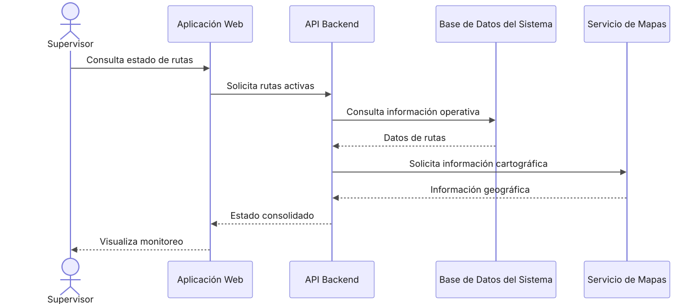

**Figura 3. Diagrama de secuencia del monitoreo de rutas en tiempo casi real.**

**Descripción del flujo**

1. El supervisor accede al módulo de monitoreo desde la Aplicación Web.
2. La Aplicación Web envía una solicitud al API Backend para consultar el estado operativo de las rutas activas.
3. El API Backend obtiene la información desde la Base de Datos del Sistema.
4. Cuando es necesario representar la ubicación geográfica de las unidades, el API Backend consulta el Servicio de Mapas para complementar la visualización de las rutas.
5. El API Backend consolida la información obtenida y responde a la Aplicación Web.
6. La Aplicación Web actualiza el tablero operativo mostrando el estado de las rutas y la ubicación de las unidades de recolección.

#### 5.3.2 Registro de una incidencia operativa

La Figura 4 presenta la interacción entre los principales contenedores durante el registro y gestión de una incidencia operativa.

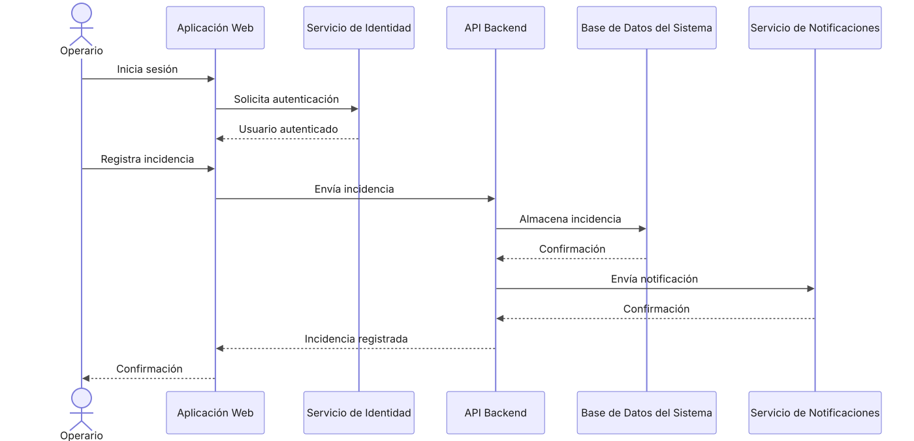

**Figura 4. Diagrama de secuencia del registro de una incidencia operativa.**

**Descripción del flujo**

1. El operario inicia sesión en la plataforma mediante el Servicio de Identidad.
2. Una vez autenticado, registra una incidencia desde la Aplicación Web.
3. La Aplicación Web envía la solicitud al API Backend.
4. El API Backend valida la autenticación del usuario, verifica los permisos asociados al rol y aplica las reglas de negocio correspondientes.
5. La incidencia se almacena en la Base de Datos del Sistema.
6. Si la incidencia requiere atención inmediata, el API Backend solicita al Servicio de Notificaciones el envío de la alerta correspondiente.

**Escenario de excepción**

Si el Servicio de Mapas no está disponible, el API Backend mantiene la información operativa disponible y utiliza la última ubicación válida registrada cuando esta exista, evitando que la falla del servicio externo impida consultar el estado de las rutas.

**Escenarios de calidad relacionados:** QS-01, QS-02 y QS-05.

7. El API Backend confirma el registro de la incidencia y devuelve el resultado a la Aplicación Web.

**Escenario de excepción**

Si el usuario no cuenta con los permisos requeridos, el API Backend rechaza la solicitud y no modifica la información operativa. La operación queda registrada mediante los mecanismos de auditoría definidos y la Aplicación Web informa al usuario que no está autorizado para realizarla.

**Escenarios de calidad relacionados:** QS-03, QS-04 y QS-05.

### 5.4 Vista de Componentes (C4 Nivel 3)

Para profundizar en la estructura del **API Backend** (Monolito Modular), se detallan los componentes internos de los dos subsistemas más críticos de la plataforma, evidenciando sus fronteras lógicas y responsabilidades.

#### 5.4.1 Subsistema: Módulo de Gestión de Incidencias


_Figura 5. Vista de Componentes del Módulo de Incidencias._

#### 5.4.2 Subsistema: Módulo de Monitoreo Geoespacial


_Figura 6. Vista de Componentes del Módulo de Monitoreo Geoespacial._

| Nodo                       | Descripción                                                                                                                        | Artefactos desplegados     | Conectividad                                                                                                                              |
| -------------------------- | ---------------------------------------------------------------------------------------------------------------------------------- | -------------------------- | ----------------------------------------------------------------------------------------------------------------------------------------- |
| Cliente / Navegador Web    | Dispositivo utilizado por operadores, supervisores y demás usuarios para acceder a la plataforma.                                  | Aplicación Web             | HTTPS hacia el API Backend                                                                                                                |
| Servidor de Aplicación     | Nodo encargado de ejecutar la lógica principal de la plataforma y exponer los servicios del sistema.                               | API Backend                | HTTPS desde la Aplicación Web; conexión SQL hacia PostgreSQL/PostGIS; comunicación con Servicio de Identidad y Servicio de Notificaciones |
| Servidor de Base de Datos  | Nodo encargado del almacenamiento persistente de la información operativa del sistema y de la información geoespacial.             | PostgreSQL + PostGIS       | Conexión SQL desde el API Backend                                                                                                         |
| Servicio de Identidad      | Servicio externo encargado de autenticar a los usuarios y proporcionar la información necesaria para validar sus permisos y roles. | Servicio de Identidad      | Comunicación segura con el API Backend mediante HTTPS                                                                                     |
| Servicio de Notificaciones | Servicio encargado del envío de alertas asociadas a incidencias que requieren atención inmediata.                                  | Servicio de Notificaciones | Comunicación segura con el API Backend mediante HTTPS                                                                                     |

La distribución propuesta permite mantener separadas las responsabilidades de presentación, lógica de negocio, persistencia, autenticación y notificaciones. El API Backend actúa como punto central de comunicación entre la Aplicación Web y los servicios de datos y externos. PostgreSQL/PostGIS concentra la información persistente y geoespacial, mientras que los servicios de Identidad y Notificaciones permanecen desacoplados de la lógica principal del sistema.

### 5.5 Vista de concurrencia.

#### 5.5.1 Justificación

La Vista de Concurrencia aplica a la plataforma debido a que durante la operación pueden ejecutarse de forma simultánea diferentes procesos. Mientras las unidades de recolección generan actualizaciones de ubicación, los supervisores pueden consultar el estado de las rutas y los operarios pueden registrar incidencias.

Además, el monitoreo de rutas utiliza procesamiento asíncrono para separar la recepción de las actualizaciones de ubicación de la actualización de la información utilizada por el dashboard operativo. Esta separación permite que la recepción de nuevas ubicaciones no dependa de que una consulta del dashboard haya finalizado.

#### 5.5.2 Modelo de concurrencia

La Figura 5 muestra de forma simplificada los principales procesos que pueden ejecutarse de manera concurrente durante la operación de la plataforma.


_Figura 5 — Modelo de concurrencia de la Plataforma de Gestión Operativa y Analítica para la Recolección de Residuos Urbanos._

El modelo contempla principalmente los siguientes procesos:

- **Recepción de ubicaciones:** recibe las actualizaciones periódicas enviadas por las unidades de recolección y registra la información correspondiente.
- **Procesamiento del monitoreo:** procesa de forma asíncrona las actualizaciones recibidas y mantiene disponible la última ubicación válida para las consultas operativas.
- **Consulta del dashboard:** permite que los supervisores consulten simultáneamente el estado de las rutas y la ubicación disponible de las unidades.
- **Registro de incidencias:** permite que los usuarios autorizados registren incidencias mientras continúan los procesos de monitoreo.

Estos procesos pueden ejecutarse simultáneamente sin requerir que una consulta del dashboard bloquee la recepción de nuevas ubicaciones.

#### 5.5.3 Recursos compartidos y consistencia

Los principales recursos compartidos corresponden a la información operativa almacenada en la Base de Datos del Sistema, incluyendo las rutas, las últimas ubicaciones válidas y las incidencias registradas.

La persistencia de las operaciones transaccionales se mantiene en PostgreSQL. En el caso de las incidencias, el registro de la información operativa y su correspondiente auditoría se mantienen dentro de la misma operación transaccional.

Para las actualizaciones de ubicación, el sistema mantiene una separación entre la recepción de los eventos y la información utilizada para las consultas del monitoreo. De esta forma, una actualización en proceso no impide que los usuarios consulten la información operativa disponible.

#### 5.5.4 Manejo de condiciones de concurrencia

La arquitectura evita depender de operaciones distribuidas para mantener la consistencia de la información. Las operaciones que requieren consistencia se resuelven mediante transacciones en la Base de Datos del Sistema.

En el caso de las actualizaciones de ubicación, la información se procesa considerando la fecha y hora de la actualización para mantener como referencia la última ubicación válida disponible. Esto evita que una actualización anterior sobrescriba información más reciente.

Las integraciones con servicios externos no forman parte de las transacciones de persistencia de la información operativa. Esto permite que una falla o demora de un servicio externo no mantenga abierta una operación transaccional durante un tiempo prolongado.

#### 5.5.5 Relación con los escenarios de calidad

La Vista de Concurrencia contribuye principalmente a los siguientes escenarios de calidad:

- **QS-01 — Rendimiento del monitoreo geoespacial:** el procesamiento asíncrono permite recibir y procesar actualizaciones de ubicación sin bloquear las consultas del dashboard.
- **QS-02 — Disponibilidad del dashboard operativo:** las consultas del monitoreo permanecen separadas de la recepción y procesamiento de nuevas ubicaciones.
- **QS-04 — Trazabilidad de incidencias operativas:** las operaciones transaccionales mantienen la consistencia entre la información registrada y su auditoría.
- **QS-05 — Interoperabilidad y tolerancia a fallos:** la separación entre las operaciones internas y los servicios externos permite manejar fallos externos sin comprometer la información operativa ya registrada.

### 5.6 Evolución del diseño

La arquitectura del sistema ha evolucionado de forma iterativa y trazable durante las fases del proyecto:

1. **Avance 1 (S07):** Se definió la Vista de Contexto, delimitando las fronteras del sistema, identificando a los actores y servicios externos, y estableciendo los Escenarios de Calidad que rigen el diseño.
2. **Avance 2 (S11):** Se descompuso la solución en la Vista de Contenedores (Aplicación Web, API Backend, PostGIS), seleccionando el estilo de Arquitectura en Capas / Monolito Modular y documentando las decisiones clave (ADRs).
3. **Entrega Final (S14):** Se profundizó al nivel de Componentes y Diseño Detallado, aplicando patrones tácticos (Unit of Work, Circuit Breaker) y principios SOLID para garantizar que el código interno cumpla con la mantenibilidad, rendimiento y auditabilidad exigidas.

### 5.6 Vista de Despliegue

La Vista de Despliegue describe cómo se distribuyen físicamente los principales componentes de la plataforma de gestión operativa y analítica para la recolección de residuos urbanos. La propuesta separa la aplicación web, el API Backend y la Base de Datos PostgreSQL/PostGIS en nodos independientes, permitiendo aislar responsabilidades, facilitar el mantenimiento y controlar el acceso a los datos.

El despliegue mantiene la decisión arquitectónica de utilizar un **API Backend como monolito modular**, evitando distribuir innecesariamente los módulos internos en múltiples servicios. De esta forma, los módulos de gestión de incidencias, monitoreo, rutas, vehículos, cuadrillas y reportes se ejecutan dentro del mismo nodo de aplicación, mientras que PostgreSQL/PostGIS se mantiene como un nodo de persistencia independiente.

Esta distribución responde principalmente a los atributos de **seguridad, disponibilidad, rendimiento, mantenibilidad y modificabilidad**, manteniendo una infraestructura sencilla de operar y evitando la complejidad adicional de un despliegue basado en microservicios.

#### 5.6.1 Diagrama de despliegue


#### 5.6.2 Distribución de nodos

| Nodo                             | Contenido                                              | Especificación mínima sugerida                              | Justificación                                                                                                                                             |
| -------------------------------- | ------------------------------------------------------ | ----------------------------------------------------------- | --------------------------------------------------------------------------------------------------------------------------------------------------------- |
| Nodo Web (Frontend)              | Aplicación Web (React) servida como contenido estático | Servidor web / CDN, 2 vCPU, 2 GB RAM                        | Carga liviana; se beneficia de cacheo y distribución estática.                                                                                            |
| Nodo de Aplicación (API Backend) | API Backend (ASP.NET Core, monolito modular)           | 4 vCPU, 8 GB RAM por instancia, mínimo 2 instancias         | Concentra la lógica de negocio, autorización y orquestación con servicios externos; requiere redundancia por ser punto crítico de disponibilidad (QS-02). |
| Nodo de Base de Datos            | PostgreSQL + PostGIS                                   | 4 vCPU, 16 GB RAM, almacenamiento SSD con IOPS garantizados | Debe soportar escritura frecuente de eventos GPS/incidencias y consultas analíticas simultáneas (ADR-002).                                                |
| Balanceador de carga             | Enruta tráfico hacia las instancias del API Backend    | —                                                           | Habilita escalamiento horizontal y tolerancia a fallos de una instancia.                                                                                  |

### 5.6.3 Decisiones de despliegue del API Backend

- **Escalamiento horizontal, no vertical como estrategia primaria:** se despliegan mínimo dos instancias del API Backend detrás de un balanceador de carga, de forma que la caída de una instancia no interrumpa el servicio (soporta QS-02, disponibilidad del dashboard ≥ 99%).
- **Instancias sin estado (stateless):** el API Backend no almacena sesión en memoria local; cualquier estado de sesión o token se valida contra el Servicio de Identidad en cada solicitud. Esto permite que el balanceador enrute solicitudes indistintamente a cualquier instancia.
- **Health checks activos:** el balanceador ejecuta verificaciones periódicas (`/health`) sobre cada instancia; una instancia que falle repetidamente se retira automáticamente de la rotación, y el tiempo de recuperación ante falla interna recuperable debe mantenerse dentro del máximo de 5 minutos definido en QS-02.
- **Configuración externalizada:** cadenas de conexión, endpoints de servicios externos (mapas, identidad, notificaciones) y parámetros de resiliencia (timeouts, umbrales de circuit breaker) se gestionan mediante variables de entorno o un servicio de configuración, evitando reconstruir el artefacto ante cambios de ambiente.
- **Despliegue por ambientes:** se mantienen ambientes separados de desarrollo, pruebas y producción, con bases de datos independientes, evitando que pruebas de carga o datos de prueba afecten la operación real.
- **Zero-downtime deployment (recomendado):** despliegues mediante actualización progresiva (rolling update) de instancias, de manera que siempre exista al menos una instancia disponible durante una nueva versión.

### 5.6.4 Decisiones de despliegue de PostgreSQL/PostGIS

- **Nodo dedicado e independiente:** la base de datos se despliega en un nodo separado del API Backend, permitiendo escalar, respaldar y asegurar cada capa de forma independiente, consistente con la separación de responsabilidades adoptada en ADR-002.
- **Alta disponibilidad mediante réplica en espera (standby replication):** se configura una instancia réplica en modo _warm standby_ con replicación asíncrona o semisíncrona, promovible a primaria ante una falla del nodo principal, para reducir el riesgo de indisponibilidad total del almacenamiento.
- **Respaldo (backup) programado:** respaldos completos diarios fuera de horario operativo y respaldo continuo de WAL (_Write-Ahead Log_) para permitir recuperación a un punto en el tiempo (_point-in-time recovery_), dado el carácter regulatorio de la información de auditoría (REST-02, REST-04).
- **Retención diferenciada:** los respaldos completos se retienen según política institucional (por ejemplo, 30 días) mientras que los registros de auditoría e histórico operativo permanecen en la base con una política de retención propia, independiente del ciclo de respaldos.
- **Particionamiento por fecha:** las tablas de eventos de ubicación GPS y de auditoría se particionan por rango de fecha a medida que el volumen crece, de forma que el mantenimiento (VACUUM, reindexado) y las consultas recientes no se degraden con el histórico acumulado (ADR-002, ADR-001).
- **Índices geoespaciales y convencionales:** índices GiST/SP-GiST sobre las columnas geométricas de PostGIS y índices B-tree sobre unidad, fecha y estado, priorizando el cumplimiento de los tiempos de respuesta de QS-01 y QS-04.
- **Aislamiento de red:** el nodo de base de datos no se expone directamente a Internet; únicamente acepta conexiones entrantes desde el nodo del API Backend, mediante reglas de firewall o grupos de seguridad restringidos al puerto de PostgreSQL.
- **Cifrado:** conexión API Backend–Base de Datos cifrada (TLS) y cifrado en reposo del volumen de almacenamiento, dado que la base contiene información operativa sensible y registros de auditoría (QA-03).
- **Monitoreo de recursos y consultas:** métricas de uso de CPU, memoria, IOPS, conexiones activas y consultas lentas (_slow queries_), con alertas ante saturación, para anticipar la contención entre las consultas transaccionales del dashboard y las consultas analíticas de reportes descrita en el análisis de trade-offs (sección 6.3.3).

### 5.6.5 Decisiones operativas transversales

| Aspecto                        | Decisión                                                                                                                                                                                                                                                                                                      |
| ------------------------------ | ------------------------------------------------------------------------------------------------------------------------------------------------------------------------------------------------------------------------------------------------------------------------------------------------------------- |
| Monitoreo y observabilidad     | El API Backend expone métricas (tiempo de respuesta, tasa de error, estado de circuit breakers) y logs estructurados centralizados, permitiendo verificar los criterios medibles de QS-01, QS-02, QS-03 y QS-05.                                                                                              |
| Gestión de secretos            | Credenciales de base de datos y claves de integración con servicios externos se almacenan en un gestor de secretos (vault) o variables de entorno protegidas, nunca en el código fuente ni en el repositorio.                                                                                                 |
| Comunicación cifrada           | Todo el tráfico entre nodos (Web–API, API–Base de Datos, API–Servicios externos) se realiza mediante HTTPS/TLS.                                                                                                                                                                                               |
| Escalamiento futuro            | Si el volumen de unidades y eventos GPS crece significativamente, el nodo de aplicación permite agregar instancias adicionales sin cambios arquitectónicos, y la separación lógica de datos en PostgreSQL (ADR-002) facilita una eventual migración del componente analítico a infraestructura independiente. |
| Aislamiento de fallos externos | Los servicios externos (mapas, identidad, notificaciones, geolocalización) no comparten infraestructura con el nodo de aplicación ni de base de datos, de modo que una falla de red hacia un proveedor externo no compromete la disponibilidad interna del sistema (ADR-003).                                 |

### 5.6.6 Trazabilidad de la vista de despliegue

| Decisión de despliegue                             | Escenario/Driver relacionado                |
| -------------------------------------------------- | ------------------------------------------- |
| Múltiples instancias del API Backend + balanceador | QS-02 (disponibilidad del dashboard), QA-01 |
| Réplica en espera de PostgreSQL                    | QS-02, REST-04                              |
| Respaldo con recuperación a punto en el tiempo     | REST-02, REST-04, QA-04                     |
| Particionamiento e índices                         | QS-01, QS-04, ADR-001, ADR-002              |
| Aislamiento de red y cifrado                       | QA-03, QS-03, ADR-004                       |
| Monitoreo y alertas                                | QA-01, QA-02, QS-02, QS-05                  |

---

## 6. Estilo Arquitectónico

### 6.1 Estilo Arquitectónico Adoptado

La solución propuesta adopta una Arquitectura en Capas (Layered Architecture) con una orientación a servicios para los componentes externos. Esta decisión permite separar claramente las responsabilidades del sistema entre la presentación, la lógica de negocio, el acceso a datos y los servicios de infraestructura.

La arquitectura se organiza en las siguientes capas:

- Capa de Presentación: corresponde a la Aplicación Web utilizada por operarios, supervisores y administradores para interactuar con el sistema.
- Capa de Lógica de Negocio: implementada por el API Backend, donde se ejecutan las reglas de negocio, la validación de permisos, el procesamiento de incidencias y la coordinación de las operaciones del sistema.
- Capa de Persistencia: encargada del almacenamiento y consulta de la información en la Base de Datos del Sistema.
- Servicios Externos: integran funcionalidades especializadas como el Servicio de Identidad para autenticación y autorización, y el Servicio de Notificaciones para el envío de alertas en tiempo real.

Este estilo arquitectónico responde a los principales drivers identificados durante el análisis, como la mantenibilidad, seguridad, disponibilidad y escalabilidad. La separación de responsabilidades facilita la evolución del sistema, permite realizar cambios de forma controlada y reduce el impacto de modificaciones futuras.

Además, la incorporación de servicios independientes para autenticación y notificaciones mejora la reutilización de componentes, fortalece la seguridad y permite escalar estos servicios sin afectar la lógica principal de la aplicación.

### 6.2 Alternativas Arquitectónicas Evaluadas

Durante el diseño se analizaron diferentes estilos arquitectónicos antes de seleccionar la arquitectura en capas.

Arquitectura Monolítica Tradicional

Se consideró una arquitectura monolítica tradicional en la que toda la funcionalidad se concentra sin una separación modular clara debido a su simplicidad de implementación y despliegue inicial. Sin embargo, fue descartada porque concentra toda la funcionalidad en una única aplicación, dificultando el mantenimiento, la escalabilidad y la evolución del sistema conforme aumenten las funcionalidades relacionadas con rutas, incidencias, monitoreo y reportes.

Arquitectura de Microservicios

También se evaluó una arquitectura basada en microservicios, la cual ofrece ventajas importantes en escalabilidad, independencia de despliegue y tolerancia a fallos. No obstante, se descartó para esta primera versión debido al incremento en la complejidad operativa, la necesidad de mecanismos adicionales de comunicación, descubrimiento de servicios, monitoreo distribuido y administración de infraestructura, aspectos que no resultan necesarios para el alcance actual del proyecto.

Arquitectura Hexagonal

Se analizó igualmente la Arquitectura Hexagonal (Ports and Adapters), reconocida por facilitar el desacoplamiento entre la lógica de negocio y las tecnologías externas. Aunque representa una excelente alternativa para sistemas con múltiples integraciones o cambios frecuentes de infraestructura, se determinó que incorporaría un nivel de complejidad superior al requerido para este proyecto académico, donde una arquitectura en capas proporciona una solución más sencilla y suficiente para satisfacer los drivers arquitectónicos identificados.

Justificación de la decisión

Finalmente, se seleccionó la Arquitectura en Capas por ofrecer el mejor equilibrio entre simplicidad, mantenibilidad, seguridad y facilidad de desarrollo. Este estilo permite una clara separación de responsabilidades, facilita las pruebas, simplifica el mantenimiento y satisface los requerimientos funcionales y atributos de calidad definidos para la plataforma de gestión operativa y analítica de recolección de residuos urbanos.

### 6.3 Análisis de Trade-offs

La arquitectura propuesta busca equilibrar la rapidez de implementación, la sostenibilidad operativa y el cumplimiento de los escenarios de calidad definidos. No existe una alternativa que maximice simultáneamente rendimiento, disponibilidad, seguridad, trazabilidad y modificabilidad; por esta razón, las decisiones adoptadas implican compromisos que deben hacerse explícitos.

#### 6.3.1 Monolito modular frente a microservicios

Se adopta inicialmente un monolito modular para el API Backend, organizado mediante módulos internos con responsabilidades y contratos definidos. Esta alternativa reduce la complejidad de despliegue, monitoreo, comunicación y consistencia transaccional durante las primeras etapas del sistema.

Una arquitectura de microservicios permitiría escalar y desplegar cada capacidad de forma independiente, además de proporcionar mayor aislamiento ante fallos. Sin embargo, introduciría comunicaciones distribuidas, consistencia eventual, observabilidad distribuida, administración de múltiples despliegues y una mayor carga operativa para el Departamento de Tecnologías de Información.

El compromiso consiste en favorecer simplicidad operativa y consistencia, aceptando un menor aislamiento de fallos y una capacidad limitada de escalamiento independiente. Para reducir este riesgo, los módulos de monitoreo, incidencias, reportes, administración y seguridad deberán mantener fronteras explícitas y evitar dependencias directas innecesarias.

**Escenarios relacionados:** QS-02 y QS-06.

**Criterio de validación:** una modificación exclusiva del módulo de reportes no deberá alterar los componentes de monitoreo ni incidencias, de acuerdo con la medida definida en QS-06.

---

#### 6.3.2 Actualización periódica frente a comunicación en tiempo real permanente

Para el monitoreo geoespacial se utilizarán actualizaciones periódicas y procesamiento asíncrono, debido a que el requerimiento establece un intervalo objetivo de 15 a 30 segundos y no una actualización instantánea de cada movimiento.

Una solución basada exclusivamente en WebSockets o transmisión continua permitiría reducir la latencia percibida, pero aumentaría la complejidad para mantener conexiones activas, gestionar reconexiones, escalar sesiones concurrentes y operar bajo conectividad intermitente.

El compromiso consiste en aceptar una latencia de hasta 30 segundos para la mayoría de las actualizaciones, a cambio de una solución más sencilla y tolerante a interrupciones breves. El procesamiento deberá desacoplar la recepción de ubicaciones de la actualización del dashboard para evitar que una consulta lenta bloquee la captura de datos.

**Escenarios relacionados:** QS-01 y QS-05.

**Criterio de validación:** al menos el 95% de las ubicaciones debe reflejarse en un máximo de 30 segundos y ninguna actualización confirmada debe perderse.

---

#### 6.3.3 Persistencia unificada frente a bases de datos especializadas

Se utilizará PostgreSQL con PostGIS como tecnología principal de persistencia, separando lógicamente la información operativa, histórica, geoespacial y de auditoría mediante esquemas, tablas, índices y vistas especializadas.

La utilización de una base transaccional y otra plataforma analítica independiente permitiría aislar las consultas de reportes y escalar las cargas de forma separada. No obstante, requeriría procesos adicionales de replicación, sincronización, transformación y resolución de inconsistencias.

El compromiso consiste en simplificar la consistencia y administración de datos, aceptando el riesgo de que las consultas históricas compitan por recursos con las operaciones diarias. Este riesgo se reducirá mediante índices geoespaciales, consultas optimizadas, particionamiento cuando el volumen lo requiera y vistas materializadas para reportes de alto costo.

**Escenarios relacionados:** QS-01, QS-04 y QS-06.

**Criterio de validación:** durante pruebas con generación de reportes, los escenarios QS-01 y QS-04 deberán mantener sus tiempos máximos de respuesta.

---

#### 6.3.4 Resiliencia frente a frescura absoluta de la información

Ante una falla del servicio de mapas o geolocalización, el sistema conservará la última ubicación válida y la mostrará con una indicación visible de que puede estar desactualizada.

Ocultar por completo la ubicación evitaría mostrar información antigua, pero eliminaría cualquier referencia disponible para el supervisor. Mantenerla sin advertencias proporcionaría mayor continuidad visual, pero podría provocar decisiones basadas en información obsoleta.

El compromiso consiste en mantener la continuidad operativa parcial, aceptando temporalmente información menos reciente, pero mostrando de forma explícita su fecha, hora y condición de desactualización.

**Escenarios relacionados:** QS-01, QS-02 y QS-05.

**Criterio de validación:** la falla debe notificarse en un máximo de 10 segundos y la última ubicación debe mostrarse con una marca de desactualización.

---

#### 6.3.5 Seguridad y auditoría frente a latencia y dependencia externa

Todas las operaciones restringidas serán validadas en el API Backend mediante autenticación, autorización por roles y políticas de acceso. Además, los intentos rechazados y las operaciones privilegiadas generarán eventos de auditoría.

Realizar únicamente controles en la Aplicación Web reduciría el procesamiento del servidor, pero permitiría que un usuario invoque directamente las operaciones del API. Mantener usuarios y contraseñas locales reduciría la dependencia del servicio de identidad, pero aumentaría los riesgos y responsabilidades asociados con el almacenamiento de credenciales.

El compromiso consiste en aceptar una pequeña latencia adicional y una dependencia del Sistema de Identidad Municipal, a cambio de centralizar la identidad, aplicar controles consistentes y mantener evidencia auditable.

**Escenarios relacionados:** QS-02, QS-03 y QS-04.

**Criterio de validación:** las solicitudes no autorizadas deben responder con código 401 o 403 en un máximo de 2 segundos y producir un registro de auditoría consultable.

---

## 7. Registro de decisiones — ADRs

Los siguientes registros documentan decisiones arquitectónicas relevantes derivadas de los drivers, restricciones y escenarios de calidad del sistema. Cada ADR presenta el contexto de la decisión, la alternativa seleccionada, las opciones descartadas y sus consecuencias.

---

### ADR-001 — Actualización periódica y procesamiento asíncrono del monitoreo geoespacial

**Estado:** Aceptada  
**Fecha:** 2026-07-12

#### Contexto

Las unidades recolectoras enviarán actualizaciones de ubicación durante la ejecución de las rutas. El dashboard operativo debe mostrar estas ubicaciones en intervalos cercanos al tiempo real, con un objetivo de 15 a 30 segundos.

La conectividad de las unidades puede ser intermitente y la recepción de una ubicación no debe quedar bloqueada por la actualización de la interfaz, la consulta del servicio de mapas o la ejecución de otros procesos.

#### Decisión

El API Backend recibirá las actualizaciones GPS mediante una interfaz HTTPS autenticada. Cada actualización válida será registrada antes de confirmar su recepción.

El procesamiento de la ubicación y la actualización de la proyección consultada por el dashboard se realizarán de forma asíncrona dentro del módulo de monitoreo. La Aplicación Web consultará periódicamente la información operativa disponible, evitando mantener una conexión permanente como requisito obligatorio.

La solución distinguirá entre:

- El evento de ubicación recibido.
- La última posición válida de cada unidad.
- La representación utilizada por el dashboard.

#### Alternativas consideradas

**WebSockets como mecanismo principal:**  
Permitirían enviar cada actualización inmediatamente al navegador, pero aumentarían la complejidad de conexiones, reconexiones, escalamiento y monitoreo.

**Consulta directa del servicio GPS desde la Aplicación Web:**  
Reduciría el procesamiento del API Backend, pero expondría la integración externa, dificultaría la auditoría y acoplaría la interfaz con el proveedor de geolocalización.

**Microservicio independiente con plataforma de mensajería:**  
Proporcionaría mayor escalabilidad y aislamiento, pero agregaría infraestructura y complejidad operativa que no se justifican en la etapa inicial.

#### Consecuencias positivas

- Se evita bloquear la recepción de ubicaciones por procesos posteriores.
- Se conserva trazabilidad sobre cada actualización aceptada.
- Se adapta mejor a conectividad intermitente.
- Se mantiene una arquitectura consistente con el API Backend existente.
- Se reduce la complejidad de mantener conexiones permanentes.

#### Consecuencias negativas

- La ubicación mostrada puede tener una demora cercana al intervalo de actualización.
- La consulta periódica genera solicitudes repetidas al API Backend.
- El almacenamiento de eventos incrementará progresivamente el volumen de datos.
- La capacidad de escalamiento independiente será menor que con un microservicio dedicado.

#### Medidas de mitigación

- Aplicar índices por unidad y fecha.
- Separar la tabla de eventos históricos de la proyección de última ubicación.
- Configurar monitoreo de colas o tareas pendientes.
- Evaluar una plataforma de mensajería si el volumen futuro supera la capacidad del procesamiento interno.

#### Trazabilidad

- RF-01 — Monitoreo de rutas y unidades.
- QA-01 — Disponibilidad.
- QA-02 — Rendimiento.
- QS-01 — Rendimiento del monitoreo geoespacial.
- QS-05 — Tolerancia a fallos externos.

#### Criterio de validación

Al menos el 95% de las actualizaciones debe mostrarse en el dashboard en un máximo de 30 segundos y ninguna actualización confirmada puede perderse.

---

### ADR-002 — Persistencia unificada con PostgreSQL y PostGIS y separación lógica de datos

**Estado:** Aceptada  
**Fecha:** 2026-07-12

#### Contexto

La plataforma debe administrar información transaccional, geoespacial, histórica y auditable. El dashboard requiere consultas frecuentes sobre rutas, incidencias y ubicaciones recientes, mientras que las jefaturas y áreas de planificación necesitan reportes históricos y métricas consolidadas.

La utilización de múltiples bases de datos permitiría optimizar cada carga, pero también aumentaría la complejidad de sincronización y operación.

#### Decisión

Se utilizará PostgreSQL con PostGIS como plataforma principal de persistencia. Los datos se separarán lógicamente mediante estructuras diferenciadas para:

- Información operativa.
- Información geoespacial.
- Historial de eventos.
- Registros de auditoría.
- Consultas y proyecciones analíticas.

Los reportes de alto costo utilizarán consultas optimizadas, vistas o vistas materializadas, evitando ejecutar agregaciones extensas directamente sobre las consultas operativas del dashboard.

La estructura deberá permitir una futura separación física del almacenamiento analítico sin modificar los contratos principales del dominio.

#### Alternativas consideradas

**Base transaccional y almacén analítico independientes:**  
Permitirían aislar cargas, pero requerirían procesos de extracción, transformación, sincronización y control de consistencia.

**Base de datos NoSQL para ubicaciones:**  
Facilitaría el almacenamiento flexible de eventos, pero complicaría las relaciones con rutas, vehículos, cuadrillas e incidencias.

**Base de datos sin extensión geoespacial:**  
Reduciría dependencias tecnológicas, pero obligaría a implementar o externalizar operaciones geográficas necesarias.

#### Consecuencias positivas

- Permite manejar datos relacionales y geoespaciales en una tecnología integrada.
- Simplifica las transacciones y la consistencia entre rutas, unidades e incidencias.
- Reduce la cantidad de tecnologías que debe operar el Departamento de TI.
- Facilita consultas con coordenadas, geometrías y recorridos.
- Permite utilizar vistas materializadas para reportes frecuentes.

#### Consecuencias negativas

- Las consultas analíticas pueden competir por recursos con la operación diaria.
- El crecimiento histórico puede incrementar los tiempos de respaldo y mantenimiento.
- La base de datos constituye una dependencia central del sistema.
- Una futura separación física requerirá migración y sincronización de datos.

#### Medidas de mitigación

- Utilizar índices convencionales y geoespaciales.
- Aplicar particionamiento por fechas cuando el volumen lo requiera.
- Ejecutar actualizaciones de vistas materializadas fuera de períodos críticos.
- Monitorear consultas lentas y consumo de recursos.
- Definir contratos de repositorio que eviten acoplar la lógica de negocio directamente a PostgreSQL.

#### Trazabilidad

- RF-03 — Generación de reportes e indicadores históricos.
- QA-04 — Auditabilidad.
- QA-05 — Modificabilidad.
- REST-02 — Trazabilidad completa.
- REST-04 — Conservación de información histórica.
- QS-01 — Rendimiento geoespacial.
- QS-04 — Trazabilidad de incidencias.
- QS-06 — Mantenibilidad.

#### Criterio de validación

La ejecución de consultas analíticas no deberá impedir el cumplimiento de los tiempos máximos definidos para el monitoreo geoespacial y el registro de incidencias.

---

### ADR-003 — Políticas de resiliencia para servicios externos

**Estado:** Aceptada  
**Fecha:** 2026-07-12

#### Contexto

La plataforma depende de servicios externos de mapas, geolocalización, identidad y notificaciones. Estos servicios pueden presentar respuestas lentas, errores temporales o interrupciones completas.

Una dependencia directa sin mecanismos de control podría provocar que una falla externa se propague al dashboard y a otros módulos de la plataforma.

#### Decisión

Las integraciones externas serán encapsuladas mediante adaptadores y aplicarán políticas de resiliencia diferenciadas según el tipo de operación.

Se implementarán:

- Tiempo máximo de espera de 5 segundos por solicitud externa.
- Hasta dos reintentos con espera incremental únicamente para operaciones idempotentes.
- Circuit breaker después de cinco fallos consecutivos.
- Conservación de la última ubicación válida.
- Identificación visible de información desactualizada.
- Registro de fallos y generación de alertas operativas.
- Recuperación automática después del período de apertura del circuito.

Los reintentos no se utilizarán de forma automática en operaciones que puedan producir notificaciones duplicadas o efectos secundarios no controlados.

#### Alternativas consideradas

**Reintentos ilimitados:**  
Podrían recuperar operaciones temporales, pero aumentarían la latencia y podrían saturar un servicio que ya se encuentra degradado.

**Fallar inmediatamente sin degradación:**  
Simplificaría la integración, pero eliminaría la visibilidad operativa ante interrupciones breves.

**Duplicar internamente todos los servicios externos:**  
Proporcionaría mayor independencia, pero implicaría costos, infraestructura y responsabilidades fuera del alcance del sistema.

#### Consecuencias positivas

- Evita que una falla externa bloquee indefinidamente el API Backend.
- Reduce la propagación de errores entre componentes.
- Mantiene información parcial disponible para los supervisores.
- Permite detectar y auditar interrupciones externas.
- Facilita sustituir un proveedor mediante el adaptador correspondiente.

#### Consecuencias negativas

- La información mostrada puede quedar temporalmente desactualizada.
- Los circuit breakers y reintentos agregan estados internos que deben monitorearse.
- Un circuito abierto puede rechazar solicitudes aunque el proveedor ya haya comenzado a recuperarse.
- Los reintentos incrementan temporalmente el consumo de recursos.

#### Medidas de mitigación

- Mostrar la fecha y hora de la última información válida.
- Configurar métricas sobre circuitos abiertos y cantidad de reintentos.
- Utilizar períodos de recuperación cortos y verificaciones controladas.
- Ajustar los parámetros de acuerdo con evidencia obtenida durante las pruebas.

#### Trazabilidad

- RF-01 — Monitoreo casi en tiempo real.
- QA-01 — Disponibilidad.
- QA-02 — Rendimiento.
- QS-02 — Disponibilidad del dashboard.
- QS-05 — Interoperabilidad y tolerancia a fallos.

#### Criterio de validación

Las fallas externas deben detectarse y notificarse en un máximo de 10 segundos, sin eliminar la última ubicación válida ni perder eventos previamente confirmados.

---

### ADR-004 — Autenticación centralizada, autorización por roles y auditoría de accesos

**Estado:** Aceptada  
**Fecha:** 2026-07-12

#### Contexto

La plataforma será utilizada por operarios, conductores, supervisores, jefaturas, analistas y administradores. Cada rol requiere permisos diferentes sobre rutas, incidencias, reportes, configuraciones y registros de auditoría.

El sistema debe integrarse con el Servicio de Identidad Municipal y evitar administrar contraseñas institucionales directamente.

#### Decisión

La autenticación se delegará al Servicio de Identidad Municipal mediante OpenID Connect y OAuth 2.0. El API Backend validará los tokens y aplicará autorización basada en roles y políticas.

Todas las operaciones se considerarán denegadas por defecto y solo se habilitarán cuando exista una política explícita.

La Aplicación Web podrá ocultar opciones según el rol para mejorar la experiencia, pero la decisión definitiva de autorización se realizará en el API Backend.

Se registrarán en auditoría:

- Intentos de acceso rechazados.
- Cambios de roles y permisos.
- Operaciones administrativas.
- Cambios relevantes sobre rutas e incidencias.
- Consulta o exportación de información sensible cuando corresponda.

Cada registro incluirá fecha y hora, usuario o identificador disponible, recurso, acción, origen y resultado.

#### Alternativas consideradas

**Usuarios y contraseñas almacenados localmente:**  
Reducirían la dependencia externa, pero aumentarían la responsabilidad de proteger credenciales y administrar ciclos de vida de usuarios.

**Controles únicamente en la Aplicación Web:**  
Serían sencillos de implementar, pero podrían evadirse invocando directamente el API Backend.

**Permisos incorporados directamente en cada controlador:**  
Permitirían una implementación rápida, pero producirían duplicación, inconsistencias y dificultad de mantenimiento.

#### Consecuencias positivas

- Centraliza la identidad institucional.
- Evita almacenar contraseñas municipales.
- Permite aplicar políticas consistentes.
- Proporciona trazabilidad de accesos y operaciones sensibles.
- Facilita agregar nuevos roles y permisos.

#### Consecuencias negativas

- El inicio de nuevas sesiones depende del Servicio de Identidad Municipal.
- La validación y auditoría agregan procesamiento a cada solicitud.
- Una definición incorrecta de roles podría conceder o bloquear accesos indebidamente.
- Los registros de auditoría incrementan el volumen de almacenamiento.

#### Medidas de mitigación

- Mantener en caché las claves públicas necesarias para validar tokens vigentes.
- Aplicar pruebas automatizadas por rol y recurso.
- Revisar periódicamente la matriz de permisos.
- Restringir el acceso a los registros de auditoría.
- Monitorear fallos de autenticación y patrones anómalos.

#### Trazabilidad

- RF-04 — Administración de usuarios, roles y permisos.
- QA-03 — Seguridad.
- QA-04 — Auditabilidad.
- REST-01 — Políticas institucionales de seguridad.
- QS-03 — Seguridad, rechazo y auditoría de accesos.
- QS-04 — Trazabilidad de incidencias.

#### Criterio de validación

El 100% de las operaciones restringidas debe validar permisos. Los accesos no autorizados deben responder con código 401 o 403 en un máximo de 2 segundos y generar un evento de auditoría consultable.

---

## 8. Diseño Detallado

Esta sección desarrolla el diseño interno del primer componente de la plataforma. El objetivo es pasar de la vista arquitectónica de contenedores a una especificación suficientemente precisa para orientar la implementación, las pruebas y las revisiones técnicas, manteniendo trazabilidad explícita con los drivers, escenarios de calidad y restricciones identificados previamente.

### 8.1 Diseño Detallado de Componentes

#### 8.1.1 Componente seleccionado: Gestión de Incidencias Operativas

El primer componente seleccionado para el diseño detallado es el **Componente de Gestión de Incidencias Operativas**, ubicado dentro del API Backend construido como monolito modular. Su propósito es registrar, consultar y dar seguimiento a eventos que afectan la ejecución normal de una ruta de recolección, manteniendo trazabilidad sobre el usuario responsable, la ruta asociada, la ubicación, el momento del registro y el estado de la incidencia.

La selección se fundamenta en que el componente materializa directamente el requerimiento funcional **RF-02 — Gestionar incidencias operativas durante los recorridos** y participa en el cumplimiento de los atributos **QA-02 — Rendimiento**, **QA-03 — Seguridad**, **QA-04 — Auditabilidad** y **QA-05 — Modificabilidad**. Asimismo, permite evaluar de manera directa los escenarios **QS-03 — Seguridad, rechazo y auditoría de accesos no autorizados**, **QS-04 — Trazabilidad de incidencias operativas** y **QS-05 — Interoperabilidad y tolerancia a fallos con servicios externos**.

El diseño se alinea con las decisiones aceptadas:

- **ADR-002:** persistencia unificada con PostgreSQL y PostGIS y separación lógica de datos.
- **ADR-003:** políticas de resiliencia para servicios externos.
- **ADR-004:** autenticación centralizada, autorización por roles y auditoría de accesos.

#### 8.1.2 Responsabilidades y límites

El componente es responsable de:

- Recibir solicitudes de registro de incidencias desde la Aplicación Web.
- Validar los datos obligatorios y las reglas de negocio.
- Verificar que la ruta exista y se encuentre en un estado que permita registrar eventos.
- Verificar que el usuario autenticado tenga autorización sobre la ruta.
- Crear la incidencia con un identificador único y estado inicial.
- Persistir la incidencia y su evento de auditoría dentro de una misma transacción.
- Evitar registros duplicados mediante una clave de idempotencia.
- Solicitar directamente una notificación cuando la severidad lo requiera.
- Aplicar un tiempo máximo de espera a la integración de notificaciones.
- Registrar el resultado de la integración externa.
- Devolver al cliente el resultado del registro y el estado de la notificación.

El componente no es responsable de:

- Autenticar credenciales institucionales.
- Administrar usuarios, contraseñas o tokens.
- Implementar el proveedor externo de notificaciones.
- Calcular recorridos o representar mapas.
- Ejecutar mantenimiento vehicular.
- Generar reportes históricos o indicadores analíticos.

La autenticación es delegada al Servicio de Identidad Municipal. El API Backend valida el token y aplica políticas de autorización. El envío efectivo de mensajes es responsabilidad del Servicio de Notificaciones.

#### 8.1.3 Estructura interna del componente

El componente se organiza en cuatro grupos:

| Grupo           | Responsabilidad                                                                              |
| --------------- | -------------------------------------------------------------------------------------------- |
| Interfaz        | Recibir solicitudes HTTP, validar su estructura y transformar resultados en respuestas REST. |
| Aplicación      | Coordinar el caso de uso sin contener detalles de persistencia o transporte.                 |
| Dominio         | Proteger las invariantes, estados y reglas propias de una incidencia.                        |
| Infraestructura | Implementar persistencia PostgreSQL/PostGIS e integración HTTP con servicios externos.       |

La lógica de negocio depende de interfaces internas. Las implementaciones de PostgreSQL, PostGIS, OAuth 2.0 y HTTP se mantienen fuera del dominio para limitar el acoplamiento tecnológico y facilitar pruebas automatizadas.

---

#### 8.1.4 Diagrama de clases de diseño


**Figura 5. Diagrama de clases de diseño del componente de Gestión de Incidencias Operativas.**

##### Justificación de las principales decisiones

- `IncidenciasController` se limita a responsabilidades HTTP.
- `RegistrarIncidenciaCasoUso` coordina el flujo y representa el objeto de control principal.
- `Incidencia` protege las reglas del dominio y no depende de ASP.NET Core ni de PostgreSQL.
- Los repositorios abstraen la persistencia definida en ADR-002.
- `INotificadorIncidencias` encapsula la integración externa conforme al ADR-003.
- `IAutorizadorIncidencias` evita incorporar decisiones de permisos directamente en el controlador.
- `IUnidadTrabajo` asegura consistencia entre la incidencia y su registro de auditoría.
- `IClock` permite controlar el tiempo durante las pruebas y evita acceder directamente al reloj del sistema.

---

#### 8.1.5 Secuencia del flujo principal

El flujo principal representa el registro exitoso de una incidencia válida por parte de un usuario autorizado. La llamada al Servicio de Notificaciones se realiza directamente después de confirmar la transacción local, en concordancia con la Vista de Comportamiento.

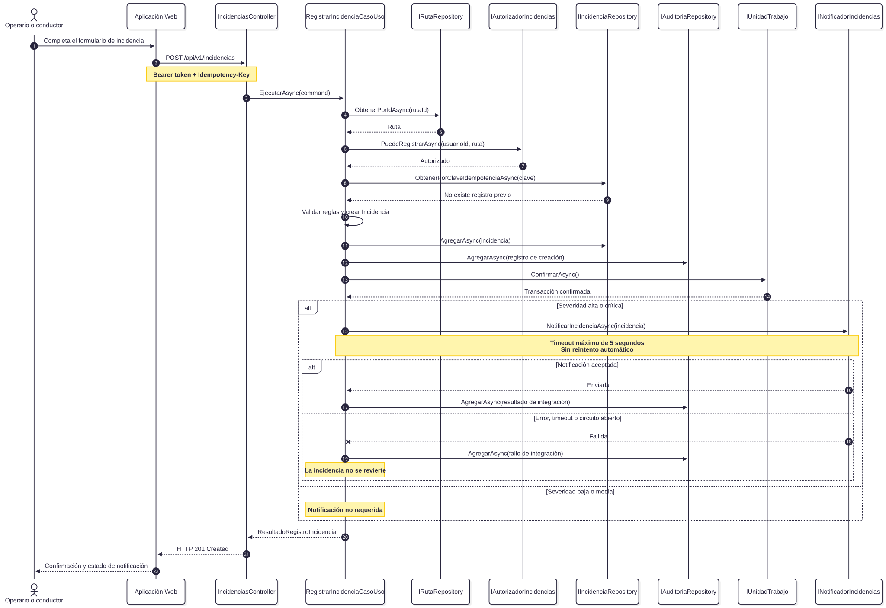

**Figura 6. Diagrama de secuencia del flujo principal de registro de una incidencia.**

##### Resultado del flujo

Al finalizar el flujo principal:

- La incidencia queda registrada con un identificador único.
- Su estado inicial es `Registrada`.
- La ruta y el usuario reportante quedan asociados.
- La fecha, ubicación, descripción, categoría y severidad quedan almacenadas.
- El evento de creación queda disponible en auditoría.
- Si corresponde, el Servicio de Notificaciones recibe una solicitud directa.
- El resultado de la integración queda registrado.
- Una falla del Servicio de Notificaciones no elimina la incidencia confirmada.
- El cliente recibe el identificador de la incidencia y el estado de la notificación.

---

#### 8.1.6 Análisis de robustez

El análisis de robustez identifica objetos de frontera, control y entidad y verifica que las responsabilidades no se mezclen.


**Figura 7. Diagrama de robustez del registro de una incidencia operativa.**

### Componente 2 — Monitoreo Geoespacial

Recibir, validar y procesar de forma asíncrona las actualizaciones de ubicación GPS de las unidades recolectoras, manteniendo un historial de recorrido y una proyección de última ubicación conocida para el dashboard operativo, sin bloquear la recepción ante fallas del Servicio de Mapas.

RF-03 (Monitorear el estado y ubicación de las unidades de recolección en tiempo casi real), sección 1.4 → Contenedor API Backend, módulo de Monitoreo, sección 5.2 (Vista de Estructura Interna)

#### 8.2.1 Diagrama de clases de diseño


_Figura 9 — Diagrama de clases de diseño: Monitoreo Geoespacial_

#### 8.2.2 Contratos de interfaz

| Método / Endpoint                                                                | Precondición                                                                                | Postcondición                                                                                          | Excepciones                                                                                                                                     |
| -------------------------------------------------------------------------------- | ------------------------------------------------------------------------------------------- | ------------------------------------------------------------------------------------------------------ | ----------------------------------------------------------------------------------------------------------------------------------------------- |
| `POST /api/v1/monitoreo/ubicaciones`                                             | Token de telemetría válido; `unidadId` existente; latitud ∈ [-90,90]; longitud ∈ [-180,180] | El evento queda encolado antes de responder; ninguna actualización confirmada se pierde                | `400` datos inválidos; `401` token inválido/expirado; `403` unidad no autorizada; `422` timestamp fuera de tolerancia; `503` cola no disponible |
| `IRecepcionUbicacionCasoUso.EncolarUbicacionAsync(ComandoUbicacion cmd)`         | `cmd` no nulo; coordenadas válidas                                                          | Evento escrito en `IColaUbicaciones`; no realiza I/O de persistencia ni de red                         | `ArgumentException` si las coordenadas no cumplen invariantes                                                                                   |
| `IServicioMapasAdapter.ObtenerReferenciaGeograficaAsync(double lat, double lon)` | Coordenadas válidas                                                                         | Retorna la referencia geográfica o `null` si el servicio falla/excede timeout; nunca bloquea más de 5s | No propaga excepciones de red; las traduce a `null`                                                                                             |
| `IUbicacionRepository.UpsertUltimaUbicacionAsync(UltimaUbicacionUnidad u)`       | `u.UnidadId` válido                                                                         | Existe un único registro vigente de última ubicación por unidad                                        | `RepositoryException` ante falla de persistencia                                                                                                |

#### 8.2.3 Análisis de robustez

| Objeto                                       | Tipo (Boundary / Control / Entity) | Responsabilidad                                                                                             |
| -------------------------------------------- | ---------------------------------- | ----------------------------------------------------------------------------------------------------------- |
| `MonitoreoController`                        | Boundary                           | Recibe la solicitud HTTP, valida su estructura y responde `202 Accepted`                                    |
| Adaptador de mapas (`IServicioMapasAdapter`) | Boundary                           | Encapsula la comunicación HTTP con el Servicio de Mapas externo                                             |
| `RecepcionUbicacionCasoUso`                  | Control                            | Valida el comando y lo encola sin persistirlo                                                               |
| `ProcesadorUbicacionWorker`                  | Control                            | Coordina el procesamiento asíncrono: persistencia, enriquecimiento geográfico y actualización de proyección |
| `UbicacionUnidad`                            | Entity                             | Representa un evento de ubicación válido y protege sus invariantes                                          |
| `UltimaUbicacionUnidad`                      | Entity                             | Representa la proyección de lectura consumida por el dashboard                                              |

#### 8.2.4 Diagrama de secuencia — flujo principal

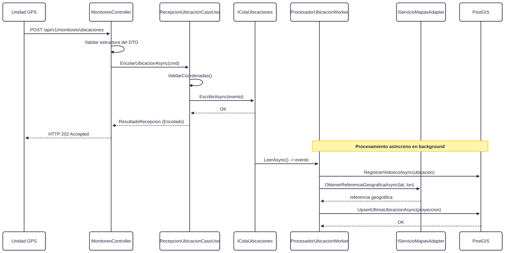

_Figura 10 — Secuencia: recepción y procesamiento asíncrono de una ubicación GPS_

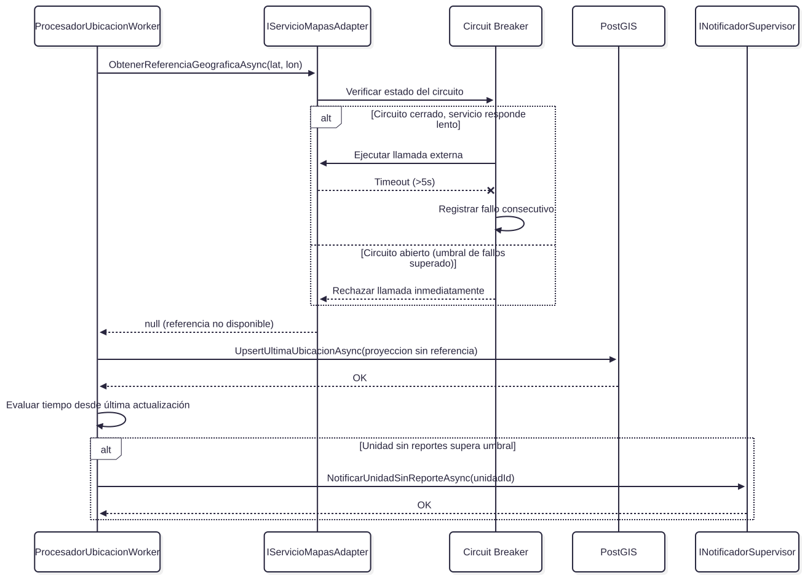

_Figura 11 — Secuencia: falla del Servicio de Mapas durante el procesamiento (circuit breaker)_

##### Objetos de frontera

| Objeto                      | Responsabilidad                                                   |
| --------------------------- | ----------------------------------------------------------------- |
| Formulario de incidencia    | Capturar la información suministrada por el usuario.              |
| `IncidenciasController`     | Exponer la interfaz REST y transformar solicitudes y respuestas.  |
| Adaptador de identidad      | Obtener la identidad validada y apoyar la evaluación de permisos. |
| Adaptador de notificaciones | Encapsular la comunicación HTTP con el proveedor externo.         |

##### Objetos de control

| Objeto                       | Responsabilidad                                                                 |
| ---------------------------- | ------------------------------------------------------------------------------- |
| `RegistrarIncidenciaCasoUso` | Coordinar todo el flujo de registro.                                            |
| `AutorizadorIncidencias`     | Evaluar el acceso de acuerdo con roles, políticas y asignación de ruta.         |
| `UnidadTrabajo`              | Confirmar atómicamente la incidencia y la auditoría de creación.                |
| Política de resiliencia      | Limitar el tiempo de espera y evitar propagación indefinida de fallos externos. |

##### Objetos de entidad

| Objeto              | Responsabilidad                                                                      |
| ------------------- | ------------------------------------------------------------------------------------ |
| `Incidencia`        | Representar el evento operativo y proteger sus invariantes.                          |
| `Ruta`              | Determinar si la ruta permite el registro y si el usuario está relacionado con ella. |
| `Ubicacion`         | Representar coordenadas geográficas válidas.                                         |
| `RegistroAuditoria` | Conservar evidencia de creación, rechazo o fallo de integración.                     |

##### Reglas verificadas

- El actor interactúa únicamente con objetos de frontera.
- Los objetos de frontera no acceden directamente a repositorios ni entidades.
- El controlador no implementa reglas de negocio.
- El objeto de control coordina entidades y puertos.
- Las entidades no dependen de tecnologías externas.
- La persistencia local se confirma antes de invocar el servicio externo.
- La falla de una notificación no revierte una incidencia confirmada.
- No se ejecutan reintentos automáticos sobre notificaciones para evitar duplicados.
- Los intentos no autorizados deben rechazarse antes de modificar información.
- Los eventos relevantes quedan registrados para auditoría.

---

#### 8.1.7 Reglas e invariantes del dominio

1. Toda incidencia debe estar asociada con una ruta existente.
2. La ruta debe permitir el registro de incidencias según su estado operativo.
3. El usuario debe estar autenticado y autorizado.
4. Un operario o conductor solo puede registrar incidencias sobre rutas asignadas.
5. Un supervisor puede registrar o gestionar incidencias dentro de su ámbito operativo.
6. La descripción es obligatoria y debe contener información significativa.
7. La categoría y severidad deben pertenecer a los catálogos definidos.
8. La latitud debe estar entre `-90` y `90`.
9. La longitud debe estar entre `-180` y `180`.
10. La fecha de ocurrencia no puede superar la tolerancia de reloj configurada.
11. Una clave de idempotencia no puede producir más de una incidencia.
12. El estado inicial de una incidencia es `Registrada`.
13. Todo cambio de estado debe generar un registro de auditoría.
14. Solo incidencias de severidad alta o crítica requieren notificación inmediata.
15. La creación y su auditoría deben confirmarse en una misma transacción.

##### Transiciones permitidas


**Figura 8. Vista de transiciones permitidas.**

No se permite regresar una incidencia cerrada a un estado anterior sin un proceso administrativo explícito y auditado.

---

#### 8.1.8 Contrato de interfaz REST

##### Registrar incidencia

| Campo           | Valor                                    |
| --------------- | ---------------------------------------- |
| Operación       | Registrar incidencia operativa           |
| Método          | `POST`                                   |
| Ruta            | `/api/v1/incidencias`                    |
| Autenticación   | OAuth 2.0 Bearer Token                   |
| Autorización    | Política `Incidencias.Registrar`         |
| Roles previstos | Operario, conductor y supervisor         |
| Entrada         | `application/json`                       |
| Salida          | `application/json`                       |
| Idempotencia    | Encabezado `Idempotency-Key` obligatorio |

##### Encabezados

```http
Authorization: Bearer {token}
Content-Type: application/json
Idempotency-Key: 872e6685-48f1-447d-ab3c-0497129498df
```

##### Solicitud

```json
{
  "rutaId": "a5b1b02d-5280-42ec-a18e-1ca3f2337861",
  "categoria": "BloqueoVia",
  "severidad": "Alta",
  "descripcion": "La vía se encuentra bloqueada por un vehículo pesado.",
  "ubicacion": {
    "latitud": 9.934739,
    "longitud": -84.087502
  },
  "fechaOcurrencia": "2026-07-12T08:32:15-06:00"
}
```

##### Precondiciones

- El token debe existir, ser válido y no estar expirado.
- La operación debe pasar por autenticación y autorización.
- La ruta debe existir.
- El usuario debe poseer permisos sobre la ruta.
- La clave de idempotencia debe estar presente.
- Los campos obligatorios deben cumplir las reglas del dominio.

##### Respuesta exitosa

```http
HTTP/1.1 201 Created
Location: /api/v1/incidencias/c552727d-7baf-42aa-a07c-86dc98b26f80
```

```json
{
  "id": "c552727d-7baf-42aa-a07c-86dc98b26f80",
  "rutaId": "a5b1b02d-5280-42ec-a18e-1ca3f2337861",
  "estado": "Registrada",
  "fechaRegistro": "2026-07-12T08:32:17-06:00",
  "notificacion": {
    "requerida": true,
    "estado": "Enviada"
  }
}
```

##### Respuesta cuando falla la notificación

La incidencia ya confirmada se mantiene registrada y se informa el resultado de la integración:

```http
HTTP/1.1 201 Created
```

```json
{
  "id": "c552727d-7baf-42aa-a07c-86dc98b26f80",
  "rutaId": "a5b1b02d-5280-42ec-a18e-1ca3f2337861",
  "estado": "Registrada",
  "fechaRegistro": "2026-07-12T08:32:17-06:00",
  "notificacion": {
    "requerida": true,
    "estado": "Fallida"
  }
}
```

##### Postcondiciones

- La incidencia existe en la base de datos.
- Posee un identificador único.
- Su estado inicial es `Registrada`.
- El usuario, la ruta y la ubicación quedan asociados.
- Existe un registro de auditoría de la creación.
- Si se intentó notificar, el resultado queda registrado.
- La operación se puede consultar inmediatamente después de la confirmación.

##### Respuestas de error

| Código                     | Condición                                                      | Comportamiento                                      |
| -------------------------- | -------------------------------------------------------------- | --------------------------------------------------- |
| `400 Bad Request`          | JSON inválido o ausencia de campos requeridos                  | No se crea la incidencia.                           |
| `401 Unauthorized`         | Token ausente, inválido o expirado                             | Se rechaza y se registra el intento.                |
| `403 Forbidden`            | Usuario sin permiso sobre la operación o ruta                  | Se rechaza, no se modifica información y se audita. |
| `404 Not Found`            | Ruta inexistente                                               | No se crea la incidencia.                           |
| `409 Conflict`             | La clave de idempotencia fue utilizada con datos incompatibles | No se crea un duplicado.                            |
| `422 Unprocessable Entity` | Incumplimiento de reglas de negocio                            | Se detallan las reglas incumplidas.                 |
| `503 Service Unavailable`  | No fue posible confirmar la persistencia local                 | No se considera registrada la incidencia.           |

Una falla del Servicio de Notificaciones no produce `503` cuando la incidencia ya fue confirmada. En ese caso se responde `201 Created` con estado de notificación `Fallida`.

---

#### 8.1.9 Contratos de interfaces internas

##### `IRegistrarIncidenciaCasoUso`

```csharp
public interface IRegistrarIncidenciaCasoUso
{
    Task<ResultadoRegistroIncidencia> EjecutarAsync(
        RegistrarIncidenciaCommand command,
        CancellationToken cancellationToken = default);
}
```

**Precondiciones:**

- `command` no puede ser nulo.
- El usuario y la ruta deben tener identificadores válidos.
- La clave de idempotencia debe estar presente.
- La ubicación debe cumplir sus invariantes.

**Postcondiciones:**

- Devuelve una incidencia existente o recién creada.
- Cuando el resultado es exitoso, la incidencia y su auditoría están confirmadas.
- El resultado informa si la notificación no era requerida, fue enviada o falló.

##### `IIncidenciaRepository`

```csharp
public interface IIncidenciaRepository
{
    Task AgregarAsync(
        Incidencia incidencia,
        CancellationToken cancellationToken = default);

    Task<Incidencia?> ObtenerPorIdAsync(
        Guid id,
        CancellationToken cancellationToken = default);

    Task<Incidencia?> ObtenerPorClaveIdempotenciaAsync(
        string claveIdempotencia,
        CancellationToken cancellationToken = default);
}
```

**Contrato:**

- No confirma por sí mismo la transacción.
- No devuelve entidades pertenecientes a otra clave de idempotencia.
- La implementación preserva la ubicación mediante tipos compatibles con PostGIS.
- No expone tipos específicos de PostgreSQL al dominio.

##### `IRutaRepository`

```csharp
public interface IRutaRepository
{
    Task<Ruta?> ObtenerPorIdAsync(
        Guid id,
        CancellationToken cancellationToken = default);
}
```

**Contrato:**

- Devuelve `null` cuando la ruta no existe.
- Devuelve la información mínima necesaria para validar estado y asignaciones.

##### `IAutorizadorIncidencias`

```csharp
public interface IAutorizadorIncidencias
{
    Task<bool> PuedeRegistrarAsync(
        Guid usuarioId,
        Ruta ruta,
        CancellationToken cancellationToken = default);
}
```

**Contrato:**

- La decisión se basa en políticas explícitas y denegación por defecto.
- Un resultado `false` impide cualquier modificación.
- El rechazo debe producir una respuesta `403` y un evento de auditoría.
- La implementación no administra credenciales.

##### `IAuditoriaRepository`

```csharp
public interface IAuditoriaRepository
{
    Task AgregarAsync(
        RegistroAuditoria registro,
        CancellationToken cancellationToken = default);
}
```

**Contrato:**

Cada registro debe incluir, cuando esté disponible:

- Fecha y hora.
- Usuario.
- Recurso.
- Acción.
- Origen.
- Resultado.
- Identificador de la entidad.
- Datos suficientes para reconstruir el evento.

##### `INotificadorIncidencias`

```csharp
public interface INotificadorIncidencias
{
    Task<ResultadoNotificacion> NotificarIncidenciaAsync(
        Incidencia incidencia,
        CancellationToken cancellationToken = default);
}
```

**Precondiciones:**

- La incidencia debe estar confirmada.
- Debe tener severidad alta o crítica.
- Debe poseer identificador definitivo.

**Postcondiciones:**

- La solicitud externa no debe esperar más de cinco segundos.
- No se ejecutan reintentos automáticos.
- Un fallo se devuelve como resultado controlado o excepción traducible.
- Un fallo no elimina ni modifica la incidencia confirmada.

##### `IUnidadTrabajo`

```csharp
public interface IUnidadTrabajo
{
    Task ConfirmarAsync(
        CancellationToken cancellationToken = default);
}
```

**Contrato:**

- Confirma atómicamente la incidencia y la auditoría de creación.
- Ante un error, ninguna de las dos operaciones queda parcialmente confirmada.
- La llamada al Servicio de Notificaciones no forma parte de la transacción.

---

#### 8.1.10 Flujos alternativos y manejo de errores

##### FA-01 — Token ausente, inválido o expirado

1. El middleware de seguridad rechaza la solicitud.
2. El API responde `401 Unauthorized`.
3. No se ejecuta el caso de uso.
4. Se registra el intento con la información disponible.
5. El registro debe quedar consultable en un máximo de cinco segundos.

##### FA-02 — Usuario sin permisos

1. La identidad es válida.
2. El autorizador determina que el usuario no puede registrar sobre la ruta.
3. El API responde `403 Forbidden`.
4. No se crea ni modifica ninguna incidencia.
5. Se registra usuario, recurso, acción, origen y resultado.

##### FA-03 — Ruta inexistente

1. El repositorio no encuentra la ruta.
2. Se detiene el procesamiento.
3. El API responde `404 Not Found`.
4. No se inicia una transacción de escritura.

##### FA-04 — Datos inválidos

1. La solicitud presenta coordenadas, descripción, categoría, severidad o fecha inválidas.
2. El API responde `400` o `422`, según el tipo de error.
3. La respuesta identifica los campos o reglas incumplidos.
4. No se persiste información parcial.

##### FA-05 — Solicitud repetida

1. Se recibe una clave de idempotencia ya procesada.
2. Si los datos coinciden, se devuelve el resultado previamente registrado.
3. Si los datos difieren, se responde `409 Conflict`.
4. Nunca se crea una segunda incidencia para la misma operación lógica.

##### FA-06 — Falla de persistencia

1. La base de datos no puede confirmar la transacción.
2. Se revierten la incidencia y la auditoría de creación.
3. No se llama al Servicio de Notificaciones.
4. El API responde `503 Service Unavailable`.

##### FA-07 — Falla del Servicio de Notificaciones

1. La incidencia y su auditoría ya fueron confirmadas.
2. La llamada supera cinco segundos, devuelve error o el circuito está abierto.
3. No se realiza reintento automático.
4. Se registra el fallo de integración.
5. La incidencia permanece con estado `Registrada`.
6. El API responde `201 Created` e informa `notificacion.estado = Fallida`.

---

#### 8.1.11 Criterios verificables de calidad

| ID    | Criterio                                                                                                                                  | Verificación                                                                  |
| ----- | ----------------------------------------------------------------------------------------------------------------------------------------- | ----------------------------------------------------------------------------- |
| CD-01 | Al menos el 99% de incidencias válidas debe confirmarse y quedar disponible para consulta en un máximo de cinco segundos.                 | Pruebas de carga e integración comparando recepción, confirmación y consulta. |
| CD-02 | El 100% de incidencias confirmadas debe contener identificador, fecha, ubicación disponible, usuario, descripción, ruta y estado inicial. | Pruebas de integración y validación en base de datos.                         |
| CD-03 | El 100% de operaciones restringidas debe pasar por autenticación y autorización.                                                          | Pruebas automatizadas por rol y recurso.                                      |
| CD-04 | Las solicitudes no autorizadas deben responder `401` o `403` en un máximo de dos segundos.                                                | Pruebas de seguridad con tokens ausentes, expirados y roles insuficientes.    |
| CD-05 | El 100% de rechazos debe generar auditoría consultable en un máximo de cinco segundos.                                                    | Consulta del registro de auditoría después de cada prueba negativa.           |
| CD-06 | La integración de notificaciones no debe esperar más de cinco segundos.                                                                   | Simulación de respuestas lentas y medición del timeout.                       |
| CD-07 | No debe ejecutarse reintento automático sobre el envío de notificaciones.                                                                 | Pruebas con proveedor simulado y conteo de invocaciones.                      |
| CD-08 | Una falla de notificación no debe eliminar ni revertir una incidencia confirmada.                                                         | Prueba de integración con error externo posterior al `commit`.                |
| CD-09 | La misma clave de idempotencia no debe crear más de una incidencia.                                                                       | Envío concurrente y repetido de la misma solicitud.                           |
| CD-10 | Una modificación interna del adaptador de notificaciones no debe requerir cambios en la entidad `Incidencia`.                             | Revisión de dependencias y pruebas de regresión.                              |

---

#### 8.1.12 Trazabilidad del diseño

| Elemento del diseño                                        | Driver, escenario o decisión atendida |
| ---------------------------------------------------------- | ------------------------------------- |
| `RegistrarIncidenciaCasoUso`                               | RF-02, QA-05, QS-04                   |
| `IAutorizadorIncidencias`                                  | RF-04, QA-03, REST-01, QS-03, ADR-004 |
| Auditoría de creación y rechazos                           | QA-04, REST-02, QS-03, QS-04, ADR-004 |
| PostgreSQL y PostGIS mediante repositorios                 | QA-04, QA-05, QS-04, ADR-002          |
| Transacción de incidencia y auditoría                      | QA-04, REST-02, QS-04, ADR-002        |
| Adaptador `INotificadorIncidencias`                        | QA-01, QA-05, QS-05, ADR-003          |
| Timeout de cinco segundos                                  | QA-01, QA-02, QS-05, ADR-003          |
| Ausencia de reintento automático en notificaciones         | QA-04, QS-05, ADR-003                 |
| Clave de idempotencia                                      | QA-04, QS-04                          |
| Separación entre dominio e infraestructura                 | QA-05, QS-06                          |
| Respuesta `201` aun cuando falla la notificación posterior | QA-01, QS-04, QS-05                   |
| Registro de fallos externos                                | QA-04, QS-05, ADR-003                 |

---

#### 8.1.13 Evaluación arquitectónica del componente

El diseño favorece la consistencia local porque la incidencia y su registro de auditoría se almacenan en PostgreSQL dentro de una misma transacción. Esta decisión está alineada con el monolito modular y con la persistencia unificada adoptada. La comunicación con el Servicio de Notificaciones se mantiene fuera de la transacción para evitar mantener bloqueos de base de datos mientras se espera una respuesta externa.

La llamada directa a notificaciones conserva concordancia con la Vista de Comportamiento, pero introduce acoplamiento temporal: el tiempo total de respuesta depende parcialmente del proveedor externo. El ADR-003 limita este impacto mediante un timeout máximo de cinco segundos y evitando reintentos automáticos que puedan duplicar mensajes. El costo de esta decisión es que una notificación fallida no se recupera automáticamente; el fallo queda registrado para atención operativa o mecanismos futuros.

La autorización se aplica en el API Backend y no únicamente en la Aplicación Web. Esto garantiza que una invocación directa al endpoint siga protegida. Además, la auditoría de accesos rechazados y operaciones relevantes permite verificar posteriormente quién intentó realizar una acción, sobre qué recurso y con qué resultado.

Finalmente, las interfaces internas reducen el acoplamiento entre el dominio, PostgreSQL, el proveedor de identidad y el proveedor de notificaciones. El componente puede evolucionar o sustituir adaptadores sin modificar las invariantes centrales de `Incidencia`, lo cual contribuye al cumplimiento de la modificabilidad establecida en QA-05 y QS-06.

---

#### 8.1.14 Conclusión del diseño detallado

El Componente de Gestión de Incidencias Operativas concreta los drivers, escenarios y ADRs del documento arquitectónico en un diseño verificable. El modelo separa interfaz, aplicación, dominio e infraestructura; aplica autorización por políticas; mantiene auditoría transaccional; utiliza PostgreSQL y PostGIS sin acoplar el dominio a la tecnología; e integra el Servicio de Notificaciones mediante un adaptador con timeout y sin reintentos automáticos.

El diseño permite registrar incidencias de manera trazable, impedir accesos no autorizados, conservar consistencia local y controlar la propagación de fallos externos. Sus contratos, flujos alternativos y criterios medibles permiten evaluar posteriormente si la implementación cumple las decisiones arquitectónicas aceptadas.

### 8.2 Diseño Detallado: Componente de Monitoreo Geoespacial

#### 8.2.1 Componente seleccionado: Monitoreo Geoespacial

El segundo componente detallado es el **Componente de Monitoreo Geoespacial**, responsable de recibir, validar, procesar de forma asíncrona y proyectar la ubicación en tiempo casi real de las unidades recolectoras. Este componente materializa el requerimiento **RF-03** y atiende los atributos de **Rendimiento (QA-02)** y **Disponibilidad (QA-01)**.

Se alinea con las siguientes decisiones arquitectónicas:

- **ADR-001:** Recepción síncrona con procesamiento asíncrono para no bloquear la operación.
- **ADR-002:** Uso de PostGIS para almacenamiento de geometrías y proyecciones.
- **ADR-003:** Resiliencia (Circuit Breaker y Timeouts) al consultar el Servicio de Mapas.

#### 8.2.2 Responsabilidades y límites

**El componente es responsable de:**

- Recibir actualizaciones de GPS desde los dispositivos de las unidades.
- Validar el formato y rango geográfico de las coordenadas.
- Confirmar la recepción rápidamente (HTTP 202 Accepted) y encolar el evento.
- Actualizar el registro histórico del recorrido en PostgreSQL (PostGIS).
- Actualizar la proyección de "última ubicación conocida" para el Dashboard.
- Tolerar latencias del Servicio de Mapas usando un Circuit Breaker.

**El componente no es responsable de:**

- Dibujar el mapa en la interfaz gráfica.
- Gestionar las incidencias operativas.
- Autenticar al dispositivo (eso se delega al API Gateway o middleware de seguridad).

#### 8.2.3 Diagrama de clases de diseño


_Figura 9. Diagrama de clases del componente de Monitoreo Geoespacial._

#### 8.2.4 Secuencia del flujo principal

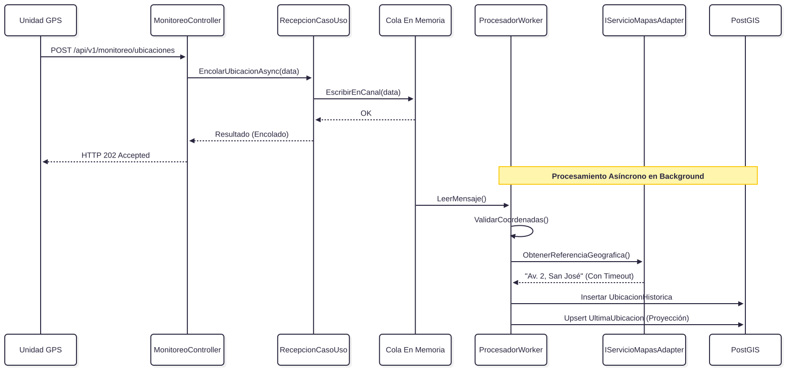

_Figura 10. Secuencia de recepción y procesamiento asíncrono._

#### 8.2.5 Contrato de interfaz REST y Robustez

**Endpoint:** `POST /api/v1/monitoreo/ubicaciones`
**Precondiciones:** Token de telemetría válido.
**Cuerpo de la Solicitud:**

```json
{
  "unidadId": "f9a2b1c3-4280-42ec-a18e-1ca3f2337111",
  "latitud": 9.932452,
  "longitud": -84.079213,
  "timestamp": "2026-07-12T08:35:10Z"
}
```

**Respuesta:** `HTTP/1.1 202 Accepted` (Procesamiento diferido).

La separación entre la recepción HTTP y el Worker en Background garantiza que, ante picos masivos de datos, el servidor no agote sus hilos (thread pool). El patrón _Circuit Breaker_ en el adaptador de mapas encapsula la fragilidad de depender de APIs externas, asegurando que el Dashboard siga recibiendo latitud/longitud aunque falte la traducción a texto de la calle.

### 8.3 Diseño Detallado: Componente de Planificación de Rutas

#### 8.3.1 Componente seleccionado: Planificación de Rutas

El tercer componente detallado aborda el núcleo logístico de la plataforma: la asignación de vehículos y cuadrillas a rutas específicas para una jornada. Materializa el requerimiento **RF-01** y es vital para la organización diaria de la Municipalidad de San José.

#### 8.3.2 Responsabilidades y límites

**Responsabilidades:** Validar la disponibilidad de vehículos y operarios para una fecha determinada, prevenir sobreasignaciones (doble turno cruzado), y generar el manifiesto de ruta para que sea consumido por el conductor.
**Límites:** No hace trazabilidad en tiempo real (es planificación a futuro) ni geocodifica mapas.

#### 8.3.3 Diagrama de clases de diseño


_Figura 12. Diagrama de clases de Planificación de Rutas._

#### 8.3.4 Secuencia del flujo principal

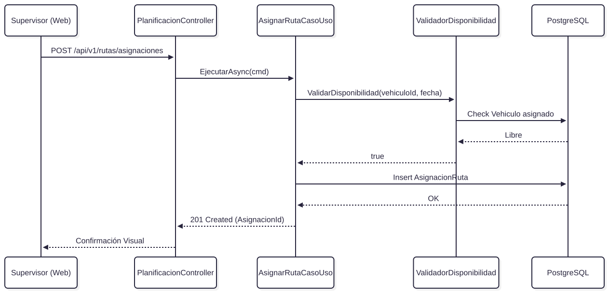

_Figura 13. Flujo de asignación de ruta._

#### 8.3.5 Contrato de interfaz REST y Robustez

**Endpoint:** `POST /api/v1/rutas/asignaciones`
**Cuerpo de la Solicitud:**

```json
{
  "rutaId": "d321c1c3-4280-42ec-a18e-1ca3f2331111",
  "vehiculoId": "b1a2b1c3-4280-42ec-a18e-1ca3f2332222",
  "fechaOperacion": "2026-08-10"
}
```

**Reglas e Invariantes del Dominio:**

1. Un vehículo no puede estar asignado a dos rutas superpuestas en el mismo turno.
2. Solo usuarios con rol de `Supervisor Operativo` o `Planificador` pueden ejecutar este endpoint.
3. Si el validador detecta conflicto de horarios, el controlador retorna `409 Conflict` evitando inconsistencias de datos.

La separación del `ValidadorDisponibilidad` como un servicio de dominio independiente garantiza la cohesión (SRP) y facilita inyectar reglas de negocio más complejas a futuro (ej. mantenimientos programados de los vehículos) sin modificar el Caso de Uso principal.

---

## 9. Patrones de Diseño Aplicados

Para satisfacer los requerimientos de disponibilidad, mantenibilidad y resiliencia, se implementaron los siguientes patrones de diseño (Gamma et al., 1995):

### 9.1 Patrón 1: Unit of Work (Unidad de Trabajo)

- **Problema específico:** Al registrar una incidencia (Componente 1), se debe guardar la entidad operativa y el evento de auditoría. Si la base de datos falla al guardar la auditoría, la incidencia quedaría registrada de forma "fantasma", violando el requerimiento regulatorio de trazabilidad (REST-02).
- **Diagrama de aplicación:** Se evidenció en la Figura 5 (Diseño del Componente 1), donde el objeto `RegistrarIncidenciaCasoUso` coordina con `IUnidadTrabajo.ConfirmarAsync()`.
- **Justificación:** Se seleccionó este patrón en lugar de hacer `commit` directamente en los repositorios, porque permite agrupar múltiples operaciones de escritura en una única transacción atómica a nivel de la capa de aplicación, garantizando que los datos operativos y los registros de auditoría sean siempre consistentes entre sí.

### 9.2 Patrón 2: Circuit Breaker (Cortacircuitos)

- **Problema específico:** El sistema depende del Servicio Externo de Mapas para geocodificar coordenadas (Componente 2). Si este servicio colapsa y experimenta _timeouts_, los hilos de procesamiento del API se quedarían bloqueados esperando respuestas, provocando una falla en cascada que tumbaría el dashboard operativo.
- **Diagrama de aplicación:** Se evidencia en la Figura 10, donde `IServicioMapasAdapter` implementa este patrón internamente.
- **Justificación:** Se eligió sobre un simple bloque `try-catch` con reintentos porque el Circuit Breaker detecta la falla continua y "abre" el circuito, fallando inmediatamente las siguientes peticiones durante un periodo de gracia. Esto permite que el sistema siga guardando las coordenadas en crudo sin saturar los recursos de red ni empeorar el estado del servicio de mapas.

### 9.3 Patrón 3: Asynchronous Competing Consumers (Consumidores Asíncronos)

- **Problema específico:** La llegada concurrente de actualizaciones de GPS cada 15 segundos desde cientos de camiones saturaría los controladores REST si se procesaran e insertaran en la base de datos de manera síncrona.
- **Diagrama de aplicación:** Se evidencia en la Figura 9, donde `IRecepcionUbicacionCasoUso` encola los mensajes y `ProcesadorUbicacionWorker` actúa como consumidor en segundo plano.
- **Justificación:** Se prefirió este patrón de mensajería interna sobre el procesamiento síncrono para nivelar la carga (_load leveling_). El controlador responde inmediatamente con un código `202 Accepted`, liberando recursos HTTP, mientras los _Workers_ consumen la cola al ritmo que soporta la base de datos PostgreSQL.

---

## 10. Principios y Técnicas Habilitadoras

El diseño de la Plataforma de Gestión Operativa y Analítica para la Recolección de Residuos Urbanos utiliza principios y técnicas de diseño orientados a preservar las fronteras arquitectónicas definidas en los niveles anteriores del documento. Su propósito es evitar que las decisiones tomadas a nivel de arquitectura —como el uso de un monolito modular, la separación de responsabilidades, la persistencia unificada y el encapsulamiento de servicios externos— se pierdan posteriormente durante el diseño interno de los componentes.

En particular, los principios **SOLID** se utilizan como guía para organizar responsabilidades y controlar la dirección de las dependencias dentro del API Backend. Su aplicación se relaciona principalmente con **QA-02 — Mantenibilidad**, que establece la necesidad de facilitar modificaciones futuras sin afectar innecesariamente otras capacidades del sistema, y con **QS-06 — Mantenibilidad y aislamiento de cambios**, cuyo criterio exige que una modificación localizada no provoque cambios en módulos no relacionados.

### 10.1 Single Responsibility Principle — SRP

El principio de responsabilidad única se refleja en la separación entre componentes de interfaz, aplicación, dominio e infraestructura.

Los controladores como `IncidenciasController`, `MonitoreoController` y `PlanificacionController` se concentran principalmente en la interacción HTTP: reciben solicitudes, realizan las validaciones correspondientes al contrato de entrada y devuelven el resultado mediante los códigos de respuesta definidos.

La lógica asociada con los procesos del negocio se delega a componentes especializados. Entre los ejemplos presentes en el diseño se encuentran:

- `RegistrarIncidenciaCasoUso`, responsable de coordinar el registro de una incidencia.
- `RecepcionUbicacionCasoUso`, encargado de coordinar la recepción de actualizaciones geoespaciales.
- `ProcesadorUbicacionWorker`, encargado del procesamiento posterior de las ubicaciones.
- `AsignarRutaCasoUso`, responsable del proceso de asignación de rutas.
- `ValidadorDisponibilidad`, encargado de concentrar las reglas relacionadas con la disponibilidad de los recursos utilizados en la planificación.

Esta separación evita que los controladores acumulen simultáneamente responsabilidades de transporte, negocio, persistencia e integración externa.

También permite que cada componente pueda evolucionar de acuerdo con una razón específica de cambio. Por ejemplo, una modificación en las reglas para determinar la disponibilidad de un vehículo no debería requerir modificar la forma en que el controlador recibe una solicitud HTTP.

---

### 10.2 Open/Closed Principle — OCP

El principio abierto/cerrado se utiliza para favorecer la extensión del comportamiento sin modificar innecesariamente los componentes que contienen las reglas principales del negocio.

Esta característica se evidencia especialmente en las integraciones externas y en el acceso a datos.

Por ejemplo, `IServicioMapasAdapter` desacopla al componente de monitoreo de una implementación específica del proveedor cartográfico. Mientras una nueva implementación mantenga el contrato esperado por la aplicación, el proveedor podría sustituirse sin trasladar dicha modificación hacia las reglas del dominio.

De manera similar, los repositorios encapsulan la interacción con PostgreSQL/PostGIS, evitando que las entidades y casos de uso dependan directamente de particularidades tecnológicas de la persistencia.

Sin embargo, la existencia de interfaces no demuestra por sí sola el cumplimiento del principio. El aislamiento deberá comprobarse mediante el impacto real de los cambios, especialmente a través del escenario **QS-06 — Mantenibilidad y aislamiento de cambios**.

---

### 10.3 Liskov Substitution Principle — LSP

Las implementaciones concretas utilizadas por los casos de uso deben conservar las condiciones y comportamientos establecidos por sus contratos.

Esto significa que la sustitución de una implementación no debería alterar las garantías asumidas por sus consumidores.

Por ejemplo, una implementación alternativa de `IServicioMapasAdapter` deberá conservar las condiciones de resiliencia definidas para la integración externa. De manera equivalente, una implementación diferente de un repositorio deberá mantener las reglas de consistencia establecidas para las entidades que administra.

Este principio resulta particularmente importante en puntos donde la arquitectura permite sustituir infraestructura sin modificar el núcleo de la aplicación.

Su cumplimiento deberá verificarse principalmente mediante pruebas de contrato e integración cuando existan múltiples implementaciones intercambiables.

---

### 10.4 Interface Segregation Principle — ISP

El diseño favorece interfaces orientadas a capacidades específicas en lugar de contratos generales que obliguen a los consumidores a depender de operaciones que no requieren.

Esta separación se observa en contratos como:

- `IIncidenciaRepository`;
- `IAutorizadorIncidencias`;
- `INotificadorIncidencias`;
- `IUnidadTrabajo`;
- `IRecepcionUbicacionCasoUso`;
- `IRepositorioUbicacion`;
- `IServicioMapasAdapter`.

Cada uno representa una responsabilidad concreta dentro de su contexto.

Este enfoque disminuye el acoplamiento entre componentes y facilita que los casos de uso dependan únicamente de los servicios necesarios para ejecutar su responsabilidad.

---

### 10.5 Dependency Inversion Principle — DIP

El principio de inversión de dependencias constituye uno de los mecanismos más relevantes para mantener separada la lógica del negocio de las tecnologías externas.

Las capas de aplicación y dominio dependen de contratos y abstracciones, mientras que los componentes de infraestructura implementan dichos contratos. La infraestructura se adapta a las necesidades definidas por las capas internas y no obliga al núcleo del sistema a conocer directamente las tecnologías utilizadas para persistencia o integración.


**Figura 14. Aplicación del principio de inversión de dependencias en el API Backend.**

La dirección mostrada en la Figura 14 representa una regla fundamental del diseño: las tecnologías de infraestructura implementan los contratos requeridos por las capas internas, evitando que el dominio dependa directamente de decisiones tecnológicas.

Por esta razón, las reglas centrales del sistema no necesitan conocer detalles específicos de PostgreSQL, PostGIS, proveedores cartográficos o servicios de notificación.

Esta decisión favorece la sustitución de componentes tecnológicos, facilita el uso de dobles de prueba y contribuye directamente al aislamiento de cambios requerido por **QS-06**.

---

### 10.6 Técnicas Habilitadoras

Los principios anteriores se complementan mediante técnicas utilizadas a lo largo del diseño para materializar las decisiones arquitectónicas.

#### Inyección de dependencias

Los casos de uso reciben repositorios, autorizadores y adaptadores mediante contratos, evitando construir dependencias concretas directamente dentro de la lógica de aplicación.

Esto permite que las implementaciones de infraestructura puedan sustituirse sin alterar necesariamente el componente que consume el contrato.

#### Repositorios

Los repositorios encapsulan las operaciones de persistencia y reducen el acoplamiento directo entre el dominio y PostgreSQL/PostGIS.

Su función no consiste únicamente en centralizar consultas, sino en proteger las capas internas de detalles específicos relacionados con almacenamiento, consultas SQL o mecanismos particulares de acceso a datos.

#### Adaptadores de integración

Las integraciones con servicios externos se encapsulan mediante adaptadores específicos.

Esta técnica permite aislar las particularidades de servicios como mapas y notificaciones y concentrar en un único punto aspectos como:

- construcción de solicitudes;
- interpretación de respuestas;
- manejo de errores;
- timeouts;
- reintentos permitidos;
- Circuit Breaker.

La utilización de adaptadores mantiene congruencia directa con **ADR-003 — Políticas de resiliencia para servicios externos**.

#### Procesamiento asíncrono

El procesamiento asíncrono permite desacoplar temporalmente determinadas operaciones.

En el componente de Monitoreo Geoespacial, la recepción de una actualización se encuentra conceptualmente separada de actividades posteriores como su procesamiento, persistencia histórica, actualización de la proyección y enriquecimiento mediante servicios externos.

Este mecanismo contribuye principalmente a QS-01 y QS-02, al evitar que las actividades posteriores bloqueen innecesariamente otros procesos de la plataforma.

#### Configuración externalizada

Parámetros como cadenas de conexión, endpoints de servicios externos, timeouts y umbrales de resiliencia se mantienen fuera del artefacto de aplicación.

La Vista de Despliegue establece el uso de variables de entorno o servicios de configuración para evitar reconstruir el sistema cuando estos parámetros cambien entre ambientes.

#### Observabilidad

La observabilidad complementa el diseño permitiendo medir el comportamiento real de los mecanismos utilizados.

La arquitectura contempla métricas, logs estructurados y health checks sobre elementos como:

- tiempo de respuesta;
- tasa de errores;
- disponibilidad;
- estado de integraciones externas;
- estado de circuit breakers;
- comportamiento de PostgreSQL/PostGIS.

Estas capacidades proporcionan la evidencia necesaria para evaluar los escenarios de calidad y orientar posteriormente la evolución arquitectónica.

---

### 10.7 Trade-off asociado a los principios de diseño

La aplicación de SRP, ISP y DIP incrementa la cantidad de interfaces, clases, DTOs, adaptadores y componentes que conforman el código.

Una implementación con menor cantidad de abstracciones podría resultar inicialmente más sencilla, pero también incrementaría el acoplamiento entre reglas de negocio, persistencia e integraciones externas.

El diseño acepta una mayor complejidad estructural cuando esta representa una frontera o responsabilidad real.

El objetivo no consiste en maximizar la cantidad de interfaces o capas, sino en mantener las dependencias explícitas y controladas. Una abstracción que no represente una necesidad concreta puede resultar tan perjudicial para la mantenibilidad como una dependencia directa innecesaria.

---

## 11. Calidad y Trazabilidad

La evaluación de la arquitectura debe realizarse tomando como referencia los escenarios de calidad definidos previamente.

La incorporación de una tecnología, patrón o mecanismo arquitectónico representa una **respuesta de diseño** a un atributo de calidad, pero no constituye por sí misma evidencia de que el escenario haya sido satisfecho.

Por ejemplo, la incorporación de un Circuit Breaker contribuye a la tolerancia a fallos, pero el cumplimiento de QS-05 solamente puede comprobarse midiendo los tiempos de detección, degradación y recuperación establecidos en el escenario.

Por esta razón, la calidad se analiza desde tres perspectivas complementarias:

1. los mecanismos utilizados para responder a los escenarios QS;
2. los trade-offs producidos entre atributos de calidad;
3. las métricas que permiten verificar el comportamiento del diseño y de la plataforma.

---

### 11.1 Validación de Escenarios de Calidad

Los seis escenarios definidos en la sección 4 establecen criterios verificables que deberán utilizarse para evaluar el comportamiento de la plataforma.

| Escenario                                           | Respuesta arquitectónica                                                                                                | Criterio de validación                                                                                                     | Mecanismo de verificación                                                                                                   |
| --------------------------------------------------- | ----------------------------------------------------------------------------------------------------------------------- | -------------------------------------------------------------------------------------------------------------------------- | --------------------------------------------------------------------------------------------------------------------------- |
| **QS-01 — Rendimiento en el monitoreo geoespacial** | Procesamiento asíncrono, separación entre evento recibido y proyección operativa, índices y almacenamiento geoespacial. | ≥95% de actualizaciones válidas reflejadas en ≤30 s; ≥99% en ≤45 s; ninguna actualización confirmada debe perderse.        | Comparación de marcas de tiempo entre recepción y disponibilidad en el dashboard; conteo de eventos recibidos y procesados. |
| **QS-02 — Disponibilidad del dashboard operativo**  | Múltiples instancias del API Backend, balanceador de carga, health checks y mecanismos de disponibilidad de PostgreSQL. | Disponibilidad mensual ≥99% durante horario operativo; recuperación de una falla interna recuperable ≤5 min.               | Monitoreo sintético sobre Web/API y registro de los tiempos de detección y recuperación.                                    |
| **QS-03 — Seguridad, rechazo y auditoría**          | OpenID Connect, OAuth 2.0, autorización por roles y políticas en Backend y auditoría de accesos.                        | 100% de operaciones restringidas sometidas a autenticación/autorización; 401/403 ≤2 s; auditoría consultable ≤5 s.         | Pruebas automatizadas con diferentes roles, ausencia de sesión, tokens inválidos y tokens expirados.                        |
| **QS-04 — Trazabilidad de incidencias**             | Persistencia transaccional, Unit of Work, identificadores únicos y auditoría.                                           | ≥99% de incidencias válidas confirmadas y consultables ≤5 s; 100% con información obligatoria.                             | Pruebas de integración y comprobación posterior de los datos persistidos.                                                   |
| **QS-05 — Interoperabilidad y tolerancia a fallos** | Timeout, Circuit Breaker, reintentos controlados, última ubicación válida y degradación funcional.                      | Falla detectada y comunicada ≤10 s después del timeout; recuperación ≤60 s después del restablecimiento del servicio.      | Simulación de errores HTTP, respuestas lentas e interrupciones temporales.                                                  |
| **QS-06 — Mantenibilidad y aislamiento de cambios** | Monolito modular, interfaces, repositorios, adaptadores y pruebas automatizadas.                                        | Modificar una regla de reportes debe afectar como máximo dos componentes y no requerir cambios en monitoreo o incidencias. | Ejercicio controlado de modificación, análisis de archivos afectados y ejecución de pruebas de regresión.                   |

Los escenarios anteriores convierten conceptos como rendimiento, disponibilidad, seguridad o mantenibilidad en condiciones que pueden ser medidas y evaluadas.

La existencia de los mecanismos arquitectónicos indicados representa el diseño propuesto para atender cada escenario. La conformidad deberá comprobarse mediante las formas de verificación establecidas.

#### Consideración específica sobre QS-01

El tiempo requerido para aceptar una solicitud HTTP no representa la misma métrica que el tiempo requerido para reflejar una ubicación en el dashboard.

QS-01 debe evaluarse considerando el recorrido completo de una actualización geoespacial:


**Figura 15. Recorrido utilizado para la medición del escenario QS-01.**

La medición deberá considerar la diferencia entre el momento de recepción de la actualización y el momento en que dicha información se encuentra disponible para ser reflejada por el dashboard.

Por lo tanto, una respuesta rápida del endpoint constituye solamente una parte del recorrido y no permite afirmar, de manera aislada, que el escenario de rendimiento haya sido satisfecho.

Asimismo, deberá verificarse independientemente la condición establecida por QS-01 de que ninguna actualización confirmada como recibida pueda perderse.

#### Consideración específica sobre QS-02

La Vista de Despliegue fortalece la respuesta arquitectónica asociada con disponibilidad mediante múltiples instancias del API Backend, balanceo de carga y health checks.

Una instancia que presente fallos repetidos puede retirarse temporalmente de la rotación, permitiendo que otras instancias continúen atendiendo solicitudes.

Sin embargo, el cumplimiento del **99% de disponibilidad mensual** definido por QS-02 deberá calcularse mediante mediciones reales durante el período evaluado. La existencia de redundancia constituye el mecanismo arquitectónico diseñado para alcanzar dicho objetivo, pero no representa por sí sola evidencia de cumplimiento.

#### Consideración específica sobre QS-03

ADR-004 establece que la Aplicación Web puede adaptar visualmente las opciones disponibles según el rol, pero la decisión definitiva de autorización permanece en el API Backend.

Esto evita depender únicamente de controles de interfaz que podrían omitirse realizando llamadas directamente contra el API.

Las pruebas deberán considerar, entre otros escenarios:

- solicitudes sin autenticación;
- tokens inválidos;
- tokens expirados;
- usuarios autenticados sin permisos;
- operaciones realizadas directamente contra el endpoint.

También deberá comprobarse la creación y posterior disponibilidad del registro de auditoría asociado con los rechazos.

---

### 11.2 Análisis de Trade-offs entre Atributos de Calidad

Las decisiones arquitectónicas adoptadas no maximizan simultáneamente todos los atributos de calidad. Cada mecanismo que favorece una característica puede introducir costos o restricciones sobre otras.

El análisis de estos trade-offs permite justificar por qué determinados compromisos son aceptables para el contexto operativo de la Municipalidad.

#### Rendimiento frente a trazabilidad

La plataforma debe conservar información histórica, incidencias, eventos operativos y registros de auditoría.

Esta necesidad incrementa las operaciones de persistencia y el volumen de almacenamiento, lo cual puede afectar el rendimiento.

Reducir la información registrada podría disminuir este costo, pero comprometería **QA-05 — Trazabilidad** y las restricciones REST-02 y REST-04.

La arquitectura prioriza la trazabilidad y mitiga su impacto mediante:

- índices;
- particionamiento;
- procesamiento asíncrono;
- proyecciones de consulta;
- monitoreo de consultas lentas.

---

#### Disponibilidad frente a seguridad

La utilización del Servicio de Identidad Municipal centraliza la autenticación y evita almacenar credenciales institucionales dentro de la plataforma.

Sin embargo, introduce una dependencia externa que puede afectar nuevos accesos cuando el servicio no se encuentra disponible.

ADR-004 acepta esta dependencia porque mantener credenciales locales incrementaría significativamente la responsabilidad de seguridad de la plataforma.

Como mecanismos de mitigación se contemplan la validación de tokens en el API Backend y la posibilidad de mantener disponibles las claves públicas necesarias para verificar tokens vigentes.

---

#### Disponibilidad frente a frescura de la información

Cuando un servicio externo de mapas o geolocalización presenta una interrupción, existen dos alternativas principales:

- eliminar la información hasta obtener una nueva actualización;
- mantener la última información válida indicando explícitamente su antigüedad.

La arquitectura selecciona la segunda alternativa.

Esto mejora la continuidad operativa del dashboard, aunque implica que determinados datos puedan encontrarse temporalmente desactualizados.

Para reducir el riesgo de interpretación incorrecta, QS-05 establece que la última ubicación debe mostrarse junto con su fecha, hora e indicación de desactualización.

---

#### Mantenibilidad frente a simplicidad estructural

La separación en casos de uso, repositorios, interfaces y adaptadores incrementa la cantidad de elementos internos de la solución.

La alternativa sería concentrar responsabilidades y utilizar dependencias directas, reduciendo el número de clases pero aumentando el acoplamiento.

Se prioriza **QA-02 — Mantenibilidad**, aceptando una mayor complejidad estructural cuando las abstracciones representan responsabilidades reales.

---

#### Escalabilidad frente a simplicidad operacional

La utilización de microservicios permitiría escalar determinadas capacidades de forma independiente.

Sin embargo, también introduciría:

- comunicación distribuida;
- coordinación entre procesos;
- mayor complejidad de observabilidad;
- despliegues independientes;
- nuevos mecanismos de consistencia;
- mayor esfuerzo de operación.

Dado que la necesidad actual no justifica estos costos, la plataforma utiliza un monolito modular y contempla inicialmente escalamiento horizontal del API Backend.

La separación en microservicios se conserva como alternativa evolutiva y no como destino obligatorio.

---

#### Persistencia unificada frente a aislamiento analítico

PostgreSQL/PostGIS concentra actualmente información transaccional, geoespacial, histórica y de auditoría.

Esta decisión simplifica la consistencia y administración, pero genera una posible competencia entre consultas operativas y cargas analíticas.

ADR-002 reconoce esta tensión y contempla como medidas de mitigación:

- índices convencionales y geoespaciales;
- particionamiento a medida que crezca el volumen;
- consultas optimizadas;
- monitoreo de consultas lentas;
- proyecciones específicas para lectura.

Si la competencia por recursos se vuelve significativa, la separación física del procesamiento analítico podrá evaluarse como una evolución posterior.

---

### 11.3 Métricas de Calidad del Diseño

Las métricas utilizadas para evaluar la arquitectura se dividen en dos categorías: **operativas** y **estructurales**.

Las métricas operativas corresponden directamente a los escenarios QS y permiten evaluar el comportamiento observable del sistema.

| Métrica                                                    | Objetivo                           |
| ---------------------------------------------------------- | ---------------------------------- |
| Latencia recepción GPS hasta disponibilidad para dashboard | P95 ≤30 s y P99 ≤45 s              |
| Pérdida de actualizaciones confirmadas                     | 0                                  |
| Disponibilidad mensual del dashboard                       | ≥99% durante horario operativo     |
| Recuperación ante falla interna recuperable                | ≤5 min                             |
| Respuesta a acceso no autorizado                           | ≤2 s                               |
| Disponibilidad del evento de auditoría de rechazo          | ≤5 s                               |
| Incidencias válidas confirmadas y consultables             | ≥99% en ≤5 s                       |
| Completitud de incidencias confirmadas                     | 100%                               |
| Detección y comunicación de falla externa                  | ≤10 s después del timeout          |
| Recuperación de integración externa                        | ≤60 s después del restablecimiento |
| Pruebas de regresión de módulos no afectados por QS-06     | 100% satisfactorias                |

Estas métricas permiten relacionar los atributos abstractos de calidad con comportamientos concretos y observables.

#### Acoplamiento eferente — Ce

El acoplamiento eferente puede utilizarse para identificar módulos o componentes que dependen de una cantidad elevada de elementos externos.

En el diseño propuesto se busca disminuir dichas dependencias mediante interfaces, repositorios y adaptadores.

No obstante, no se establece un valor numérico de Ce como resultado mientras no exista evidencia generada mediante una herramienta de análisis estático aplicada sobre la implementación.

El valor deberá interpretarse además dentro del contexto del componente: un número reducido de dependencias no garantiza por sí mismo una arquitectura correcta.

#### Cohesión — LCOM4

LCOM4 puede utilizarse como indicador complementario para detectar clases que agrupan conjuntos de métodos con poca relación entre sí.

El objetivo consiste en identificar posibles violaciones de SRP y componentes que podrían estar concentrando múltiples responsabilidades.

Al igual que con Ce, su valor deberá obtenerse mediante medición real del código y no asumirse únicamente a partir del diseño.

#### Violaciones de fronteras modulares

Una métrica especialmente relevante para el monolito modular será la cantidad de dependencias que atraviesen las fronteras establecidas sin utilizar contratos públicos.

El criterio deseado es:

**0 violaciones deliberadas de las reglas de frontera definidas entre módulos.**

Esto incluye evitar accesos directos a estructuras internas de otro módulo cuando existe una interfaz o contrato definido para esa interacción.

#### Impacto de cambio

QS-06 proporciona una métrica directamente relacionada con mantenibilidad.

Un cambio localizado sobre una regla de reportes deberá mantenerse dentro del módulo correspondiente y afectar como máximo los componentes establecidos por el escenario.

Esta medición resulta especialmente valiosa porque evalúa la mantenibilidad a partir de un cambio real y no exclusivamente mediante métricas estáticas.

---

### 11.4 Calidad y Operación

Los escenarios de calidad solamente pueden gestionarse de manera efectiva si el comportamiento de la plataforma puede observarse durante su operación.

La Vista de Despliegue incorpora mecanismos de monitoreo y observabilidad sobre el API Backend y sus dependencias, incluyendo tiempos de respuesta, tasa de errores, logs estructurados y estado de circuit breakers.

La relación entre los escenarios definidos y la evidencia operacional puede representarse de la siguiente manera:


**Figura 16. Ciclo de validación y retroalimentación de los atributos de calidad.**

Este ciclo evita que los atributos de calidad permanezcan únicamente como declaraciones documentales.

Las decisiones arquitectónicas generan mecanismos concretos; dichos mecanismos producen información observable y esa evidencia permite determinar posteriormente si los criterios establecidos por los escenarios de calidad están siendo satisfechos.

Además, los resultados obtenidos pueden retroalimentar las decisiones existentes. Por ejemplo, si las métricas del procesamiento geoespacial muestran un crecimiento sostenido de eventos pendientes, dicha evidencia podría justificar posteriormente una revisión del mecanismo de procesamiento asíncrono.

#### Monitoreo del API Backend

Se deberán observar como mínimo:

- tiempos de respuesta;
- tasa de solicitudes;
- códigos de error;
- disponibilidad de instancias;
- estado de health checks;
- utilización de recursos;
- fallos de dependencias externas.

Los health checks permiten que el balanceador retire temporalmente una instancia que no se encuentre en condiciones de atender solicitudes.

La disponibilidad real deberá medirse a nivel del servicio ofrecido al usuario y no únicamente mediante el estado individual de las instancias.

---

#### Monitoreo geoespacial

El procesamiento de ubicaciones deberá proporcionar métricas que permitan reconstruir el recorrido de las actualizaciones y detectar posibles acumulaciones de trabajo.

Entre los indicadores relevantes se encuentran:

- cantidad de actualizaciones recibidas;
- cantidad de actualizaciones procesadas;
- eventos pendientes;
- errores de procesamiento;
- antigüedad de la última ubicación válida;
- tiempo entre recepción y disponibilidad para consulta;
- diferencia entre eventos confirmados y eventos efectivamente procesados.

Estas métricas proporcionan la información necesaria para verificar QS-01 y determinar si la capacidad de procesamiento disponible resulta suficiente.

También permiten identificar situaciones en las que una actualización haya sido recibida pero su procesamiento posterior se encuentre retrasado.

---

#### PostgreSQL/PostGIS

La base de datos constituye un componente crítico debido a que concentra persistencia operativa, geoespacial, histórica y de auditoría.

La operación deberá observar al menos:

- utilización de CPU;
- consumo de memoria;
- IOPS;
- conexiones activas;
- crecimiento del almacenamiento;
- consultas lentas;
- duración de consultas geoespaciales;
- duración de consultas analíticas;
- utilización de índices;
- comportamiento de las particiones.

Estas métricas permitirán anticipar problemas de contención entre operaciones transaccionales y consultas analíticas antes de que comprometan QS-01 o QS-04.

---

#### Integraciones externas

El estado de las integraciones debe ser observable mediante:

- tiempo de respuesta;
- cantidad de timeouts;
- cantidad de reintentos;
- estado de cada Circuit Breaker;
- errores por proveedor;
- tiempo requerido para recuperar la comunicación.

ADR-003 establece como diseño un timeout máximo de cinco segundos, hasta dos reintentos para operaciones idempotentes y apertura del circuito después de cinco fallos consecutivos.

La telemetría permitirá comprobar posteriormente si estos valores resultan adecuados y ajustarlos de acuerdo con evidencia obtenida durante las pruebas y la operación.

---

#### Seguridad y auditoría

La plataforma deberá permitir observar:

- accesos rechazados;
- cambios de roles y permisos;
- operaciones administrativas relevantes;
- modificaciones sobre rutas e incidencias;
- fallos de autenticación;
- patrones anómalos relacionados con accesos.

Los registros deberán mantener la información necesaria para identificar:

- fecha y hora;
- usuario o identificador disponible;
- recurso;
- acción;
- origen;
- resultado.

La disponibilidad y consulta de estos eventos constituye además una parte de la verificación de QS-03.

---

#### Recuperación y respaldo

La Vista de Despliegue contempla mecanismos de réplica y respaldo para PostgreSQL/PostGIS.

Sin embargo, la existencia de un respaldo no demuestra por sí sola que el sistema pueda recuperarse.

Por esta razón, la operación deberá contemplar verificaciones periódicas de restauración que permitan comprobar que los mecanismos definidos son utilizables cuando ocurra una falla real.

De esta manera, la calidad operacional cierra la relación entre diseño, implementación y evidencia, permitiendo que las decisiones arquitectónicas puedan revisarse a partir del comportamiento observado del sistema.

---

## 12. Secciones Específicas según el Tipo de Sistema

Esta sección complementa las decisiones arquitectónicas generales mediante aspectos específicos derivados del tipo de solución desarrollada. En particular, se profundiza en la organización interna del API Backend, la estrategia utilizada para soportar las consultas frecuentes del dashboard operativo y la incorporación de capacidades analíticas basadas en Inteligencia Artificial Generativa.

Estas decisiones mantienen la arquitectura actual como un **monolito modular**, evitando introducir distribución física innecesaria, pero preservando fronteras que permitan una evolución progresiva cuando los requerimientos del negocio o los escenarios de calidad lo justifiquen.

---

### 12.1 Diseño del API Backend como Monolito Modular — H14-014

La plataforma adopta un **monolito modular** para el API Backend. Esta decisión permite mantener las capacidades principales dentro de una misma unidad de despliegue, conservando simultáneamente fronteras lógicas explícitas entre las diferentes responsabilidades del negocio.

Entre las principales capacidades identificadas se encuentran:

- planificación y asignación de rutas;
- gestión de incidencias;
- monitoreo geoespacial;
- generación de reportes y análisis;
- seguridad, autorización y auditoría.

El objetivo consiste en aprovechar la simplicidad operacional y las capacidades transaccionales de un monolito sin construir una estructura interna fuertemente acoplada.

El enfoque resulta congruente con la arquitectura en capas seleccionada previamente: las capacidades se ejecutan dentro del mismo API Backend, pero sus responsabilidades internas permanecen separadas mediante casos de uso, contratos, repositorios y adaptadores.

#### Reglas de frontera

Cada módulo debe mantener claramente identificados:

- sus casos de uso;
- sus entidades y reglas de negocio;
- sus contratos públicos;
- sus repositorios;
- la información de la cual es responsable.

Como regla general, un módulo no debe acceder directamente a elementos internos de otro cuando exista un contrato definido para realizar dicha interacción.

En particular, no se utiliza como mecanismo de integración entre módulos la ejecución directa de `JOIN` sobre tablas que pertenecen exclusivamente a otro contexto funcional.

La finalidad de esta restricción es impedir que la existencia de una única base de datos física produzca acoplamiento lógico entre los módulos.

#### Comunicación entre módulos

Cuando dos capacidades necesitan colaborar, la interacción puede realizarse mediante dos mecanismos principales.

**Interfaces internas explícitas**

Se utilizan cuando la interacción es síncrona y el componente consumidor necesita una respuesta inmediata.

Por ejemplo, un módulo podría consultar una capacidad expuesta por otro mediante una interfaz interna sin acceder directamente a sus estructuras de persistencia.

**Eventos de dominio internos**

Pueden utilizarse cuando una operación principal produce una consecuencia secundaria que no requiere formar parte de la misma interacción síncrona.

Este mecanismo permite reducir el acoplamiento temporal entre determinados componentes.

Una librería específica para implementar estos eventos constituye un detalle de implementación y no una dependencia arquitectónica obligatoria.

#### Beneficios del monolito modular

La decisión proporciona varios beneficios para la etapa actual de la plataforma:

- una única unidad principal de despliegue;
- menor complejidad operacional que una arquitectura de microservicios;
- transacciones locales mediante PostgreSQL;
- menor cantidad de comunicación distribuida;
- posibilidad de aplicar escalamiento horizontal al API Backend;
- fronteras internas que favorecen QA-02 — Mantenibilidad;
- posibilidad de evaluar posteriormente la extracción de capacidades específicas.

El monolito modular también contribuye a **QS-06 — Mantenibilidad y aislamiento de cambios**, dado que una modificación localizada debería permanecer dentro de los límites del módulo correspondiente.

#### Trade-off

La principal desventaja consiste en que todas las capacidades continúan compartiendo una misma unidad de despliegue.

Por lo tanto, no es posible escalar o desplegar individualmente un módulo sin separar previamente dicha capacidad del monolito.

Este compromiso se acepta porque la arquitectura actual no posee evidencia que justifique asumir desde el inicio los costos asociados con microservicios, tales como comunicación distribuida, consistencia entre procesos, observabilidad adicional y mayor complejidad operacional.

La posibilidad de evolución permanece abierta, pero no constituye un objetivo obligatorio.

---

### 12.2 Proyecciones del Dashboard Operativo — H14-015

El dashboard operativo presenta un patrón de acceso diferente al de las operaciones transaccionales.

Mientras la plataforma recibe ubicaciones, registra incidencias y modifica el estado de las rutas, los supervisores necesitan consultar repetidamente una representación consolidada y actualizada de la operación.

Reconstruir esta información ejecutando múltiples `JOIN`, agregaciones y cálculos geoespaciales sobre las estructuras transaccionales en cada actualización del dashboard podría incrementar innecesariamente el costo de las consultas y producir competencia por recursos con los procesos de escritura.

Por esta razón, el diseño utiliza una separación lógica inspirada en **CQRS — Command and Query Responsibility Segregation**.

La utilización de este enfoque no implica implementar dos aplicaciones o dos bases de datos independientes. La separación ocurre inicialmente dentro de la misma plataforma PostgreSQL/PostGIS.


**Figura 17. Separación lógica entre operaciones transaccionales y proyección de consulta del dashboard.**

El modelo de escritura conserva la información transaccional e histórica necesaria para la operación y trazabilidad.

De forma complementaria, el procesamiento de monitoreo mantiene una **proyección de lectura** preparada para responder eficientemente a las consultas frecuentes del dashboard.

Esta proyección puede incluir información como:

- identificador de la unidad;
- placa;
- ubicación actual disponible;
- estado de la ruta;
- fecha y hora de la última actualización;
- indicador de información desactualizada cuando corresponda.

El dashboard consulta esta representación evitando reconstruir constantemente el estado operativo mediante consultas complejas sobre la información histórica.

#### Diferencia entre proyección operativa y vista materializada

La proyección utilizada para representar la última ubicación de las unidades no debe confundirse necesariamente con una vista materializada de PostgreSQL.

La **proyección operativa** corresponde a información derivada que puede ser actualizada por los procesos del sistema a medida que ocurren nuevos eventos.

Las **vistas materializadas**, contempladas también como alternativa dentro de ADR-002, resultan más apropiadas para consultas analíticas o agregaciones de mayor costo que puedan actualizarse mediante procesos programados.

Esta distinción permite utilizar diferentes estrategias de lectura según el tipo de información requerida.

#### Beneficios

La separación lógica de escritura y lectura permite:

- reducir el costo de las consultas frecuentes del dashboard;
- disminuir la necesidad de ejecutar `JOIN` complejos durante cada actualización;
- optimizar índices según los patrones de lectura;
- desacoplar parcialmente las necesidades operativas de las consultas históricas;
- facilitar una futura separación física si las métricas demuestran que resulta necesaria.

#### Trade-off

La utilización de una proyección introduce información derivada que debe permanecer sincronizada con los eventos que la originan.

Por esta razón, deberá observarse el tiempo transcurrido entre la recepción de una actualización y la disponibilidad de la información correspondiente en la proyección.

Esta medición forma parte directa de **QS-01 — Rendimiento en el monitoreo geoespacial**.

---

### 12.3 Sistemas con Inteligencia Artificial Generativa o Agentes — H14-016

Como capacidad analítica complementaria se propone incorporar un **Agente Analítico basado en RAG — Retrieval-Augmented Generation**, orientado a apoyar a las jefaturas y al personal de planificación durante el análisis de información histórica.

Esta capacidad se relaciona principalmente con **RF-04 — Generar reportes e indicadores para apoyar la toma de decisiones**.

El agente no sustituye los procesos operativos ni participa en la toma automática de decisiones sobre rutas, vehículos, cuadrillas o incidencias.

Su función consiste en proporcionar un mecanismo adicional para explorar información histórica mediante lenguaje natural.

#### Problema analítico

Los reportes estructurados permiten responder preguntas previamente conocidas mediante indicadores, filtros y agregaciones.

Sin embargo, determinadas consultas pueden requerir explorar múltiples registros históricos para encontrar eventos relacionados, patrones recurrentes o situaciones similares.

Por ejemplo:

> ¿Qué tipos de incidencias se han presentado con mayor recurrencia en determinadas zonas y qué registros históricos respaldan esa observación?

Un mecanismo RAG permite recuperar información relacionada con la consulta antes de solicitar al modelo generativo que construya una respuesta.

#### Arquitectura propuesta

El flujo conceptual del agente se organiza en cuatro etapas principales:


**Figura 18. Flujo conceptual del Agente Analítico basado en RAG.**

#### 1. Preparación de información

Las incidencias cerradas utilizadas para fines analíticos se preparan antes de ser incorporadas al índice vectorial.

Cuando corresponda, la información deberá anonimizarse o transformarse para evitar incorporar datos que no sean necesarios para la finalidad analítica.

#### 2. Generación de embeddings

Los registros preparados se transforman en representaciones vectoriales.

Estas representaciones pueden almacenarse mediante la extensión `pgvector` dentro de PostgreSQL.

La plataforma mantiene así diferentes capacidades dentro del mismo ecosistema tecnológico:

- PostgreSQL para información relacional;
- PostGIS para información geoespacial;
- `pgvector` para búsqueda basada en similitud semántica.

Cada extensión mantiene una responsabilidad diferente.

#### 3. Recuperación de contexto

Cuando un analista formula una pregunta, el sistema recupera los registros históricos considerados más relevantes para dicha consulta.

El conjunto recuperado constituye el contexto que será utilizado posteriormente durante la generación.

Cuando resulte necesario, las capacidades semánticas y geoespaciales pueden combinarse para restringir la recuperación según criterios de ubicación.

#### 4. Generación y trazabilidad

La pregunta y el contexto recuperado son enviados al modelo generativo.

El API deberá incorporar controles que limiten el contexto suministrado, definan instrucciones explícitas y permitan conservar trazabilidad sobre la información utilizada.

Las respuestas generadas deberán incluir referencias o identificadores de las incidencias utilizadas como evidencia.

Esto permite que el usuario consulte posteriormente las fuentes y realice una validación humana del resultado.

#### Human-in-the-loop

Las respuestas generadas por el modelo constituyen **asistencia analítica** y no decisiones institucionales automáticas.

El usuario continúa siendo responsable de interpretar los resultados y verificar los registros utilizados como evidencia.

El modelo no deberá ejecutar automáticamente acciones como:

- modificar una ruta;
- reasignar vehículos;
- cambiar el estado de una incidencia;
- modificar usuarios o permisos;
- alterar información operacional.

#### Aislamiento del núcleo operativo

La capacidad RAG deberá permanecer fuera del camino crítico de operación.

Una indisponibilidad del modelo generativo, del proceso de embeddings o de las consultas vectoriales no deberá impedir:

- recibir ubicaciones GPS;
- consultar el dashboard operativo;
- registrar incidencias;
- planificar rutas;
- utilizar los mecanismos tradicionales de reportes.


**Figura 19. Aislamiento de la capacidad analítica RAG respecto al núcleo operacional.**

Esta separación preserva los atributos de disponibilidad de la plataforma y evita introducir la dependencia de un modelo generativo dentro de procesos operativos esenciales.

#### Evolución de la capacidad analítica

La utilización inicial de PostgreSQL y `pgvector` mantiene coherencia con ADR-002 y evita incorporar una plataforma vectorial independiente sin una necesidad demostrada.

Si posteriormente el volumen de embeddings o las consultas analíticas generan competencia significativa con la operación transaccional, podrá evaluarse la separación de dicha carga.

La decisión deberá sustentarse en las métricas operativas definidas en la sección 11 y formalizarse mediante un ADR cuando represente un cambio arquitectónico significativo.

---

## 13. Tendencias y Evolución del Diseño

La arquitectura se plantea como una solución evolutiva.

Esto significa que las tecnologías futuras no se incorporarán únicamente por constituir tendencias de la industria. Su adopción deberá responder a un problema concreto, una necesidad institucional o evidencia obtenida mediante los escenarios y métricas de calidad.

---

### 13.1 Tendencias Arquitectónicas

#### Edge Computing

El procesamiento en el borde representa una posible evolución para determinadas funciones asociadas con las unidades recolectoras.

En un escenario futuro, algunas operaciones simples podrían realizarse en dispositivos asociados con los vehículos antes de transmitir la información hacia la plataforma central.

Entre las capacidades candidatas se encuentran:

- validaciones básicas sobre las coordenadas;
- filtrado de datos evidentemente inválidos;
- almacenamiento temporal cuando exista pérdida de conectividad.

Este enfoque podría reducir transmisiones innecesarias y mejorar el comportamiento ante conectividad intermitente.

No obstante, también introduciría nuevas responsabilidades relacionadas con:

- seguridad de dispositivos;
- actualización de software;
- sincronización;
- monitoreo distribuido;
- administración de infraestructura adicional.

Por esta razón, Edge Computing se mantiene como una posibilidad de evolución y no como una responsabilidad de la arquitectura actual.

---

#### Capacidades vectoriales sobre PostgreSQL

La incorporación propuesta de `pgvector` para el componente analítico RAG permite extender PostgreSQL con capacidades de búsqueda por similitud semántica.

Esta decisión mantiene inicialmente una plataforma de datos unificada:

- PostgreSQL para información relacional;
- PostGIS para información geoespacial;
- `pgvector` para representaciones vectoriales.

La utilización conjunta de estas capacidades permitiría posteriormente realizar consultas que combinen información histórica, geográfica y semántica.

Sin embargo, el procesamiento vectorial deberá mantenerse fuera del camino crítico de monitoreo e incidencias.

Si las cargas analíticas comienzan a competir significativamente con las operaciones de la jornada, su separación deberá evaluarse de acuerdo con ADR-002.

---

#### Arquitecturas orientadas a eventos

El procesamiento asíncrono utilizado actualmente en monitoreo constituye una base para evolucionar hacia mecanismos de mensajería más robustos cuando las necesidades operativas lo requieran.

La adopción de mensajería persistente podría justificarse ante indicadores como:

- crecimiento sostenido del volumen de ubicaciones;
- acumulación frecuente de eventos pendientes;
- necesidad de consumidores independientes;
- requisitos superiores de durabilidad;
- necesidad de desacoplar el ciclo de vida de los eventos del ciclo de vida de las instancias del API.

La selección de una tecnología concreta deberá realizarse mediante un ADR específico cuando exista evidencia suficiente para justificarla.

No se establece en esta etapa una tecnología obligatoria de mensajería.

---

#### Observabilidad como capacidad arquitectónica

El crecimiento del sistema incrementará la importancia de disponer de métricas, logs estructurados, trazas y health checks.

La observabilidad no se considera solamente una herramienta operacional. También constituye un mecanismo para orientar la evolución arquitectónica.

Las decisiones relacionadas con:

- escalamiento;
- optimización de PostgreSQL;
- ajuste de políticas de resiliencia;
- incorporación de mensajería;
- separación de cargas analíticas;
- extracción de módulos;

deberán basarse preferiblemente en evidencia obtenida mediante estas métricas y no únicamente en estimaciones.

---

### 13.2 Evolución del Diseño

La evolución de la arquitectura se plantea de forma incremental y condicionada por evidencia.

#### Etapa 1 — Arquitectura actual

La plataforma mantiene como línea base:

- Aplicación Web independiente basada en React.
- API Backend ASP.NET Core.
- Monolito modular.
- PostgreSQL/PostGIS como persistencia principal.
- Procesamiento asíncrono interno.
- Integraciones externas mediante adaptadores.
- Escalamiento horizontal del API Backend.
- Balanceo de carga y health checks.
- Mecanismos de observabilidad.

Esta estructura deberá conservarse mientras continúe satisfaciendo los escenarios de calidad definidos.

La utilización de un monolito modular permite además conservar límites internos que podrían facilitar futuras modificaciones sin introducir actualmente la complejidad operacional de una arquitectura distribuida.

---

#### Etapa 2 — Optimización dentro de la arquitectura actual

Antes de distribuir la solución en nuevos servicios se priorizarán mecanismos compatibles con la arquitectura existente.

Entre las primeras alternativas se encuentran:

- incorporación de instancias adicionales del API;
- optimización de consultas;
- creación o ajuste de índices;
- particionamiento de información histórica;
- optimización de proyecciones;
- ajuste de políticas de resiliencia;
- revisión de recursos asignados a PostgreSQL/PostGIS.

Esta etapa permite aprovechar la capacidad del monolito modular antes de asumir el costo operacional de una arquitectura distribuida.

La necesidad de evolucionar deberá determinarse mediante evidencia proporcionada por las métricas definidas en la sección 11.

---

#### Etapa 3 — Mensajería persistente

Si las métricas demuestran que el procesamiento interno deja de satisfacer las necesidades de volumen, concurrencia o durabilidad, el mecanismo de eventos podrá evolucionar hacia un **Message Broker persistente**.

La utilización de mensajería externa permitiría:

- desacoplar la recepción del procesamiento;
- conservar eventos independientemente de una instancia particular del API;
- permitir múltiples consumidores;
- absorber picos de carga;
- facilitar procesamiento especializado.

En esta etapa no se define de manera obligatoria Apache Kafka, RabbitMQ u otra tecnología.

La selección deberá formalizarse posteriormente mediante un ADR que considere:

- garantías de entrega requeridas;
- volumen de eventos;
- patrones de consumo;
- capacidades del Departamento de TI;
- complejidad operacional;
- costos de infraestructura y mantenimiento.

---

#### Etapa 4 — Extracción progresiva de capacidades

Si uno de los módulos comienza a requerir escalamiento, disponibilidad o despliegue independiente, podrá evaluarse su separación del monolito.

El módulo de Monitoreo Geoespacial constituye un posible candidato debido a que posee:

- un flujo de entrada claramente identificado;
- procesamiento asíncrono;
- contratos específicos;
- persistencia y proyección geoespacial;
- integraciones externas particulares.

Sin embargo, su extracción no se considera un objetivo obligatorio.

Antes de realizarla deberá comprobarse que los beneficios obtenidos superan los costos derivados de:

- comunicación distribuida;
- consistencia entre servicios;
- observabilidad adicional;
- despliegues independientes;
- operación de nueva infraestructura.

La estrategia de extracción deberá ser progresiva, manteniendo en lo posible los contratos existentes mientras se trasladan las responsabilidades fuera del monolito.

---

#### Etapa 5 — Separación del procesamiento analítico

Si los reportes históricos, análisis geoespacial avanzado o capacidades asociadas con RAG comienzan a competir de forma significativa con la operación transaccional, podrá evaluarse una separación física de dichas cargas.

Esta evolución puede contemplar alternativas como:

- réplicas orientadas a lectura;
- almacenamiento analítico independiente;
- procesos de consolidación;
- infraestructura separada para procesamiento vectorial.

La decisión deberá sustentarse en métricas relacionadas con:

- consultas lentas;
- consumo de CPU;
- IOPS;
- bloqueos o contención;
- afectación sobre los tiempos de QS-01 y QS-04.

La separación deberá conservar los contratos que actualmente evitan que la lógica del negocio dependa directamente de una tecnología particular de persistencia.

---

#### Evolución hacia múltiples ámbitos operativos

La ampliación futura de la plataforma hacia otros ámbitos geográficos o institucionales requerirá un análisis específico.

La expansión territorial no debe interpretarse automáticamente como un requisito de **multitenancy**.

Si en el futuro múltiples entidades debieran utilizar la misma plataforma manteniendo aislamiento entre sus datos y configuraciones, entonces sí sería necesario evaluar explícitamente:

- aislamiento de información;
- seguridad entre tenants;
- configuración independiente;
- gobierno de datos;
- escalamiento;
- responsabilidades administrativas.

Esta decisión deberá surgir de un nuevo driver de negocio y no únicamente del crecimiento técnico de la solución.

---

En síntesis, la evolución de la plataforma seguirá un enfoque de **crecimiento basado en evidencia**.

El objetivo no consiste en migrar obligatoriamente hacia microservicios, Kubernetes, mensajería distribuida, Edge Computing o nuevas plataformas de datos.

La arquitectura deberá conservar la capacidad de adoptar estas alternativas cuando los escenarios de calidad, las métricas operativas o nuevos requerimientos del negocio demuestren que la arquitectura actual ya no resulta suficiente.

---

## 14. Glosario

- **ADR (Architecture Decision Record):** Documento corto que captura una decisión arquitectónica significativa aceptada.
- **Circuit Breaker:** Patrón de diseño que detecta fallas y encapsula la lógica para evitar que dichas fallas afecten otros sistemas.
- **CQRS:** Separación de los modelos de comando (escritura) y los modelos de consulta (lectura).
- **RAG:** Generación Aumentada por Recuperación, técnica para inyectar datos propios a modelos fundacionales de IA.
- **SRP:** Principio de Responsabilidad Única (SOLID).

## 15. Referencias

- Brown, S. (2014). _Software Architecture for Developers_. Leanpub.
- Budgen, D. (2003). _Software Design_ (2.ª ed.). Addison-Wesley.
- Gomaa, H. (2011). _Software Modeling and Design_. Cambridge University Press.
- Gamma, E., Helm, R., Johnson, R., & Vlissides, J. (1995). _Design Patterns_. Addison-Wesley.

---
