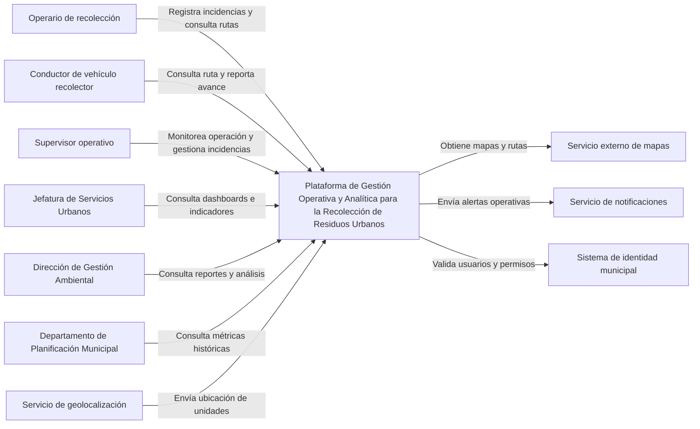

# Vista de Contexto C4

## Introducción

La vista de contexto representa la Plataforma de Gestión Operativa y Analítica para la Recolección de Residuos Urbanos dentro de su entorno de operación, mostrando los principales actores que interactúan con ella y los sistemas externos necesarios para soportar sus funcionalidades. El objetivo de esta vista es proporcionar una comprensión de alto nivel del sistema y de las relaciones existentes con elementos externos, sin exponer detalles internos de implementación.

De acuerdo con el modelo C4 propuesto por Brown, la vista de contexto constituye el nivel más alto de abstracción y permite representar el sistema como una única unidad funcional dentro del ecosistema en el que opera, facilitando la comunicación entre los distintos interesados y proporcionando una comprensión común del alcance de la solución (Brown, 2014). Asimismo, Gomaa señala que las vistas arquitectónicas deben permitir identificar las interacciones entre el sistema y su entorno, favoreciendo el entendimiento de los requisitos y las responsabilidades asociadas a cada actor (Gomaa, 2011).

La Figura 1 presenta la vista de contexto correspondiente a la Plataforma de Gestión Operativa y Analítica para la Recolección de Residuos Urbanos.

## Sistema

La Plataforma de Gestión Operativa y Analítica para la Recolección de Residuos Urbanos es una solución orientada a apoyar las operaciones de recolección de residuos de la Municipalidad de San José. La plataforma permite planificar y asignar rutas, administrar vehículos y cuadrillas, monitorear geoespacialmente las unidades recolectoras, registrar incidencias operativas y generar reportes e indicadores para apoyar la supervisión y la toma de decisiones.

En esta vista, el sistema se representa como una única unidad funcional, sin mostrar módulos internos ni detalles tecnológicos, ya que estos serán abordados posteriormente en las vistas de contenedores y componentes. Este nivel de abstracción permite concentrarse en las relaciones existentes entre el sistema, sus usuarios y las dependencias externas, tal como es recomendado por el modelo C4 (Brown, 2014).

## Actores externos

La plataforma es utilizada por diferentes actores con responsabilidades y necesidades de información específicas.

### Operarios de recolección

Los operarios interactúan con el sistema para registrar incidencias ocurridas durante la ejecución de las rutas y consultar las tareas asignadas. La relación correspondiente se encuentra etiquetada como:

**Registra incidencias y consulta rutas asignadas.**

### Conductores de vehículos recolectores

Los conductores utilizan la plataforma para consultar los recorridos asignados y reportar el avance de las rutas en ejecución. La relación asociada es:

**Consulta ruta asignada y reporta avance del recorrido.**

### Supervisores operativos

Los supervisores son responsables del seguimiento de las unidades recolectoras y de la gestión de las incidencias reportadas durante la operación. La interacción con la plataforma se representa mediante:

**Monitorea operación, gestiona incidencias y verifica cumplimiento.**

### Jefatura de Servicios Urbanos

La Jefatura de Servicios Urbanos utiliza la información consolidada para supervisar la operación y apoyar la toma de decisiones. La relación correspondiente es:

**Consulta dashboards, reportes e indicadores operativos.**

### Dirección de Gestión Ambiental

La Dirección de Gestión Ambiental requiere información histórica y analítica para evaluar el desempeño del servicio y apoyar procesos de mejora continua. La interacción se representa mediante:

**Consulta análisis de desempeño y reportes ambientales.**

### Departamento de Planificación Municipal

Este departamento utiliza la información histórica y las métricas generadas por el sistema para apoyar los procesos de planificación y análisis. La relación correspondiente es:

**Consulta métricas históricas e información para planificación.**

Gomaa (2011) establece que la identificación de actores y responsabilidades constituye un elemento fundamental en la definición de la arquitectura y en la comprensión de las interacciones existentes entre el sistema y su entorno.

## Sistemas externos

La plataforma requiere integrarse con diferentes servicios externos que proporcionan capacidades necesarias para la operación, pero que se encuentran fuera del alcance de la solución.

### Servicio externo de mapas

Proporciona las capacidades de visualización cartográfica y soporte geoespacial necesarias para representar rutas y ubicaciones de las unidades recolectoras.

La relación correspondiente se encuentra etiquetada como:

**Obtiene mapas, rutas, geocodificación y visualización.**

### Servicio o dispositivo de geolocalización

Proporciona la ubicación periódica de las unidades recolectoras durante la ejecución de las rutas.

La interacción se representa mediante:

**Envía ubicación de unidades cada 15 a 30 segundos.**

### Servicio de notificaciones

Permite enviar alertas y eventos relevantes asociados a incidencias, retrasos o situaciones operativas que requieren atención.

La relación correspondiente es:

**Envía alertas de incidencias, atrasos o eventos relevantes.**

### Sistema de identidad municipal

Es responsable de la autenticación y autorización de los usuarios de la plataforma, permitiendo aplicar mecanismos de acceso basados en roles.

La relación asociada es:

**Valida identidad, roles y permisos de acceso.**

Brown (2014) señala que uno de los objetivos principales de la vista de contexto consiste en mostrar claramente las relaciones existentes entre el sistema y los sistemas externos con los que intercambia información, permitiendo delimitar el alcance de la solución y comprender las dependencias presentes.

## Leyenda

| Elemento             | Descripción                                                                                        |
| -------------------- | -------------------------------------------------------------------------------------------------- |
| Actor externo        | Persona o entidad organizacional que interactúa directamente con la plataforma.                    |
| Sistema              | Solución objeto de estudio representada como una única unidad funcional.                           |
| Sistema externo      | Servicio o sistema fuera del alcance de la solución que intercambia información con la plataforma. |
| Relación             | Flujo de información o interacción entre dos elementos.                                            |
| Etiqueta de relación | Descripción del propósito de la interacción entre los elementos relacionados.                      |

## Consideraciones

La vista de contexto tiene como propósito mostrar la plataforma dentro de su entorno y describir las interacciones de alto nivel con actores y sistemas externos. Por esta razón, no se representan componentes internos, bases de datos, tecnologías específicas ni mecanismos de implementación. Dichos aspectos serán desarrollados en las vistas arquitectónicas posteriores correspondientes al nivel de contenedores y componentes. Esta separación progresiva de niveles de abstracción constituye uno de los principios fundamentales del modelo C4 (Brown, 2014).

**Figura 1. Vista de contexto C4 de la Plataforma de Gestión Operativa y Analítica para la Recolección de Residuos Urbanos.**

###### Figura 1
